# Enterprise Legal Contract Assistant: Week-by-Week Implementation & AI Learning Report

> **Project Name**: Enterprise Legal Contract Assistant & RAG Platform  
> **Repository**: `legal-contract-rag`  
> **Target Audience**: Non-technical stakeholders, Junior AI Developers, Engineering Leads, and System Architects  
> **Author**: AI Engineering Learning Track (Track F: Legal Contracts)  
> **Date**: September 2026  

---

## 🧭 Executive Summary & Roadmap

This comprehensive report provides a complete, week-by-week breakdown of the AI concepts, architectural decisions, practical implementations, and empirical benchmark findings developed across the **Enterprise Legal Contract Assistant** project.

The system is a production-grade, modular **Retrieval-Augmented Generation (RAG)** and **Autonomous Agent Platform** designed specifically for high-stakes legal document intelligence. Over the course of 10 structured weeks, the platform evolved from fundamental document extraction and chunking to hybrid retrieval, error taxonomy, automated evaluation suites, ReAct agent loops, trajectory debugging, Model Context Protocol (MCP) tool decoupling, and empirical multi-agent cost-tax analysis.

```text
========================================================================================
                          10-WEEK AI ENGINEERING ROADMAP
========================================================================================
 Week 1 : Document Extraction & Legal-Aware Clause Chunking
    ↓
 Week 2 : Dense Embeddings, Vector Stores & Asynchronous Queue Ingestion
    ↓
 Week 3 : Provider-Agnostic LLM Gateway & Grounded RAG Pipeline
    ↓
 Week 4 : Hybrid Search (Okapi BM25 + Dense Vectors) & Reciprocal Rank Fusion (RRF)
    ↓
 Week 5 : Open-Coded Error Analysis, Trace Diagnostics & Failure Taxonomy
    ↓
 Week 6 : Automated Evals (Deterministic Assertions vs Few-Shot LLM Judge & RAGAS)
    ↓
 Week 7 : Autonomous ReAct Agents vs Fixed Workflows & Operational Budgets
    ↓
 Week 8 : Trajectory Evaluations, Right-Answer/Wrong-Path Gap & Security Defenses
    ↓
 Week 9 : Model Context Protocol (MCP), Zero-Code Discovery & Security Gateway
    ↓
 Week 10: Multi-Agent Orchestrator vs Single Agent Race, Context Tax & A2A Standard
========================================================================================
```

---

# Week 1: Document Processing, Extraction & Legal-Aware Clause Chunking

## 1. Task Overview and Expected Output
* **The Task**: Build a document ingestion and parsing pipeline that ingests messy commercial legal documents (in PDF, DOCX, and plain text formats) and splits them into clean, semantically coherent text units ("chunks") suitable for AI indexing.
* **Expected Implementation**: A document ingestion engine that accepts binary files, extracts raw text with accurate page tracking, and breaks down the text into chunks without cutting contractual clauses, definitions, or sentences in half.
* **Actual Implementation**:
  * Implemented dedicated multi-format extractors in [TxtExtractor](file:///e:/Selvamani/Learning/AI%20Learning/legal-contract-rag/processor/extractors/txt_extractor.py), [PdfExtractor](file:///e:/Selvamani/Learning/AI%20Learning/legal-contract-rag/processor/extractors/pdf_extractor.py), and [DocxExtractor](file:///e:/Selvamani/Learning/AI%20Learning/legal-contract-rag/processor/extractors/docx_extractor.py).
  * Built a specialized [LegalAwareChunker](file:///e:/Selvamani/Learning/AI%20Learning/legal-contract-rag/processor/chunkers/legal_aware_chunker.py) that uses regex patterns to identify legal boundaries (Articles, Sections, Subsections, Schedules, Clauses) and preserve contractual hierarchy.
  * Implemented a fallback [RecursiveChunker](file:///e:/Selvamani/Learning/AI%20Learning/legal-contract-rag/processor/chunkers/recursive_chunker.py) for unstructured legal narrative text.
* **Gaps / Limitations**: Scanned image PDFs without embedded OCR text layers require an external OCR tool (such as Tesseract or Azure Document Intelligence) to extract text before parsing.

## 2. Main Objective
In legal contracts, meaning is strictly tied to hierarchy and clause structure. If an arbitrary chunking algorithm cuts off a clause midway (for example, separating *"The Lessee shall pay $10,000 monthly"* from its conditional qualifier *"unless the property is under repair"*), the downstream AI will deliver legally dangerous and inaccurate advice. The main objective was to create a **structure-preserving legal parser** that treats complete legal clauses as single atomic thoughts.

## 3. AI Concept and Learning Stage
* **AI Concept**: *Document Extraction & Semantic/Structural Chunking*.
* **Why It Is Important**: Large Language Models (LLMs) have finite context windows and process information in tokens. Chunking breaks vast 100-page contracts into bite-sized, self-contained paragraphs.
* **Advantage**: Preserves critical legal context, prevents fragmented clauses, and attaches structural metadata (e.g., `Article 10`, `Section 10.2`) directly to each chunk.
* **Learning Journey Fit**: This is Stage 1 of RAG. Poor chunking permanently degrades all downstream retrieval and generation; no advanced LLM can fix a poorly cut chunk.
* **Real-World Analogy**: Think of a cookbook. If you cut the page in half with scissors and give someone the ingredient list without the baking temperature, the recipe fails. Chunking ensures each recipe step remains intact.

## 4. How It Was Implemented in Our Project
* **Extractors**: [processor/extractors/base.py](file:///e:/Selvamani/Learning/AI%20Learning/legal-contract-rag/processor/extractors/base.py) defines the `BaseExtractor` contract. [pdf_extractor.py](file:///e:/Selvamani/Learning/AI%20Learning/legal-contract-rag/processor/extractors/pdf_extractor.py) utilizes `pypdf` to extract text page by page, while [docx_extractor.py](file:///e:/Selvamani/Learning/AI%20Learning/legal-contract-rag/processor/extractors/docx_extractor.py) processes Microsoft Word XML paragraphs and tables.
* **Chunkers**: [processor/chunkers/legal_aware_chunker.py](file:///e:/Selvamani/Learning/AI%20Learning/legal-contract-rag/processor/chunkers/legal_aware_chunker.py) scans text with regexes for patterns like `ARTICLE\s+([IVXLCDM\d]+)`, `Section\s+(\d+\.\d+)`, and `Schedule\s+([A-Z\d-]+)`. If a legal section exceeds `max_chunk_size` (default: 1000 characters), it recursively splits on paragraph breaks (`\n\n`) and sentence endings while maintaining a 100-character overlap.
* **Tests**: Verified via [tests/test_extractors_and_chunkers.py](file:///e:/Selvamani/Learning/AI%20Learning/legal-contract-rag/tests/test_extractors_and_chunkers.py) and [tests/test_chunking.py](file:///e:/Selvamani/Learning/AI%20Learning/legal-contract-rag/tests/test_chunking.py).

## 5. Workflow Using Our Current Architecture

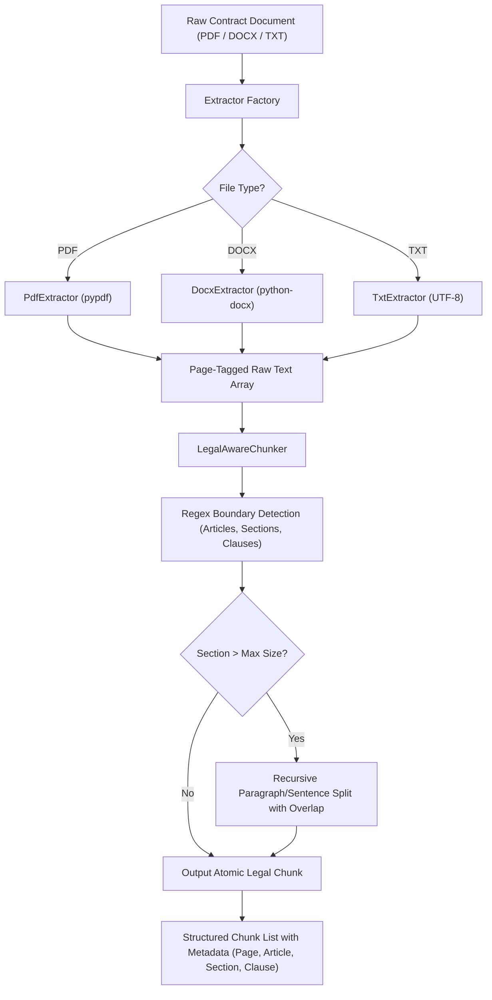

```text
[Raw Document: PDF/DOCX/TXT]
      │
      ▼
[Extractor Engine] ──> Extracts text with Page Numbers
      │
      ▼
[LegalAwareChunker] ──> Detects Articles & Sections via Regex
      │
      ▼
[Atomic Legal Chunks] ──> Tagged with: {contract_id, page, section, clause}
```

> **Step 1:** The user uploads a raw contract (PDF, DOCX, or TXT).  
> **Step 2:** The extractor identifies the file extension and extracts text page-by-page.  
> **Step 3:** The [LegalAwareChunker](file:///e:/Selvamani/Learning/AI%20Learning/legal-contract-rag/processor/chunkers/legal_aware_chunker.py) detects legal section headers (e.g., `ARTICLE IV`, `Section 4.1`).  
> **Step 4:** Atomic legal clauses are created. If any clause is excessively long, it is subdivided gracefully with overlap.  
> **Step 5:** Chunks are tagged with precise metadata (`page_number`, `article`, `section`, `clause`).

## 6. File-by-File Explanation

| File | Purpose | What It Does | Why It Is Needed |
| :--- | :--- | :--- | :--- |
| [processor/extractors/base.py](file:///e:/Selvamani/Learning/AI%20Learning/legal-contract-rag/processor/extractors/base.py) | Abstract Extractor Interface | Defines the `extract(file_bytes)` signature returning page dictionaries. | Enforces a consistent contract across all file extractors. |
| [processor/extractors/pdf_extractor.py](file:///e:/Selvamani/Learning/AI%20Learning/legal-contract-rag/processor/extractors/pdf_extractor.py) | PDF Text Extraction | Uses `pypdf` to extract text and record physical page numbers. | Extracts text from standard digital PDF contracts. |
| [processor/extractors/docx_extractor.py](file:///e:/Selvamani/Learning/AI%20Learning/legal-contract-rag/processor/extractors/docx_extractor.py) | Word Document Extraction | Uses `python-docx` to iterate through paragraphs and tabular contract schedules. | Extracts text from modern Word contracts and amendments. |
| [processor/chunkers/legal_aware_chunker.py](file:///e:/Selvamani/Learning/AI%20Learning/legal-contract-rag/processor/chunkers/legal_aware_chunker.py) | Structural Legal Clause Chunker | Identifies Article/Section headers using regex and preserves clause integrity. | Prevents splitting legal sentences across arbitrary token boundaries. |
| [processor/chunkers/recursive_chunker.py](file:///e:/Selvamani/Learning/AI%20Learning/legal-contract-rag/processor/chunkers/recursive_chunker.py) | Fallback Recursive Chunker | Splits text by character length, paragraph breaks, and sentence stops. | Handles non-standard legal texts lacking formal numbering. |

## 7. Why We Chose This Approach
* **Why Legal-Aware Chunking over Naive Character Splitting?** Naive splitting (e.g., cutting every 500 characters) cuts numbers, dates, and dependent clauses in half. Legal-aware chunking keeps entire legal rules together, guaranteeing that the AI sees both the obligation and its exceptions in one chunk.
* **Trade-Off**: Regex parsing requires well-formatted documents. For unstructured narratives, we backstop the system with a recursive sliding-window fallback.

> [!TIP]
> **Week 1 Key Takeaway**: In domain-specific RAG (like Legal), **how you cut your text is how your AI thinks**. Structure-aware chunking dramatically outperforms naive character slicing by preserving domain boundaries.

---

# Week 2: Embeddings, Vector Databases & Asynchronous Queue Ingestion

## 1. Task Overview and Expected Output
* **The Task**: Convert legal text chunks into mathematical vectors (embeddings), store them in a vector database with contract metadata, and build an enterprise background queue pipeline for asynchronous processing.
* **Expected Implementation**: An asynchronous document ingestion queue that accepts uploads instantly (HTTP 202), stores files in blob storage, generates text embeddings in batches, and indexes them into ChromaDB with strict contract filtering tags.
* **Actual Implementation**:
  * Integrated **Azurite Blob & Queue Storage** (local Azure emulator) for background job coordination.
  * Implemented an **Azure Functions Document Processor** ([function_app.py](file:///e:/Selvamani/Learning/AI%20Learning/legal-contract-rag/processor/function_app.py)) triggered by queue events (`legal-document-processing`).
  * Built dynamic embedding services supporting local `nomic-embed-text` (Ollama), `jina-embeddings-v2-base-en` (OpenRouter), and Google `text-embedding-004`.
  * Configured **ChromaDB** with metadata indexing (`contract_id`, `document_id`, `page`, `section`, `clause`).
* **Gaps / Limitations**: If ChromaDB runs as an in-memory client without persistent volume mounts, data will reset upon container restart. We resolved this by mounting Docker volumes to `/chroma/chroma`.

## 2. Main Objective
Commercial contracts can be 100+ pages long. Processing them synchronously blocks API threads, causing HTTP gateway timeouts (504 Gateway Timeout). The objective was to build a **non-blocking, event-driven ingestion architecture** that processes documents in the background while mapping semantic concepts into a searchable vector space.

## 3. AI Concept and Learning Stage
* **AI Concept**: *Text Embeddings, Dense Vector Spaces & Vector Databases*.
* **Why It Is Important**: Computers cannot understand raw text words directly. Embeddings convert words and sentences into long arrays of numbers (e.g., 768 or 1536 dimensions) where semantically similar legal phrases (e.g., *"Termination for Convenience"* and *"Ending the agreement without cause"*) sit close to each other in mathematical space.
* **Advantage**: Enables "meaning-based" search rather than relying purely on exact keyword matches.
* **Learning Journey Fit**: Stage 2 of RAG. Once text is chunked, it must be vectorized and indexed into a specialized vector store (like ChromaDB) for high-speed nearest-neighbor cosine similarity search.
* **Real-World Analogy**: Think of a GPS coordinate system. Instead of searching for the exact letters "Eiffel Tower", you look for coordinates within 100 meters of Paris landmarks.

## 4. How It Was Implemented in Our Project
* **Asynchronous Queue Pipeline**: When a user uploads a document via `POST /api/v1/documents`, [backend/app/services/storage_service.py](file:///e:/Selvamani/Learning/AI%20Learning/legal-contract-rag/backend/app/services/storage_service.py) saves the raw file to Azurite Blob Storage and [backend/app/services/queue_service.py](file:///e:/Selvamani/Learning/AI%20Learning/legal-contract-rag/backend/app/services/queue_service.py) enqueues a JSON message with the `document_id` and `contract_id`. The API immediately returns HTTP `202 Accepted`.
* **Worker Function**: The Azure Function worker ([processor/function_app.py](file:///e:/Selvamani/Learning/AI%20Learning/legal-contract-rag/processor/function_app.py)) detects the queue message, downloads the blob, extracts text, calls [LegalAwareChunker](file:///e:/Selvamani/Learning/AI%20Learning/legal-contract-rag/processor/chunkers/legal_aware_chunker.py), batches chunks into groups of 10 for embedding generation via [processor/services/embedding_service.py](file:///e:/Selvamani/Learning/AI%20Learning/legal-contract-rag/processor/services/embedding_service.py), and indexes them into ChromaDB via [processor/services/chroma_service.py](file:///e:/Selvamani/Learning/AI%20Learning/legal-contract-rag/processor/services/chroma_service.py).
* **Metadata Scoping**: Every vector in ChromaDB is indexed with `where={"contract_id": "<ID>"}` to enforce 100% data isolation.

## 5. Workflow Using Our Current Architecture

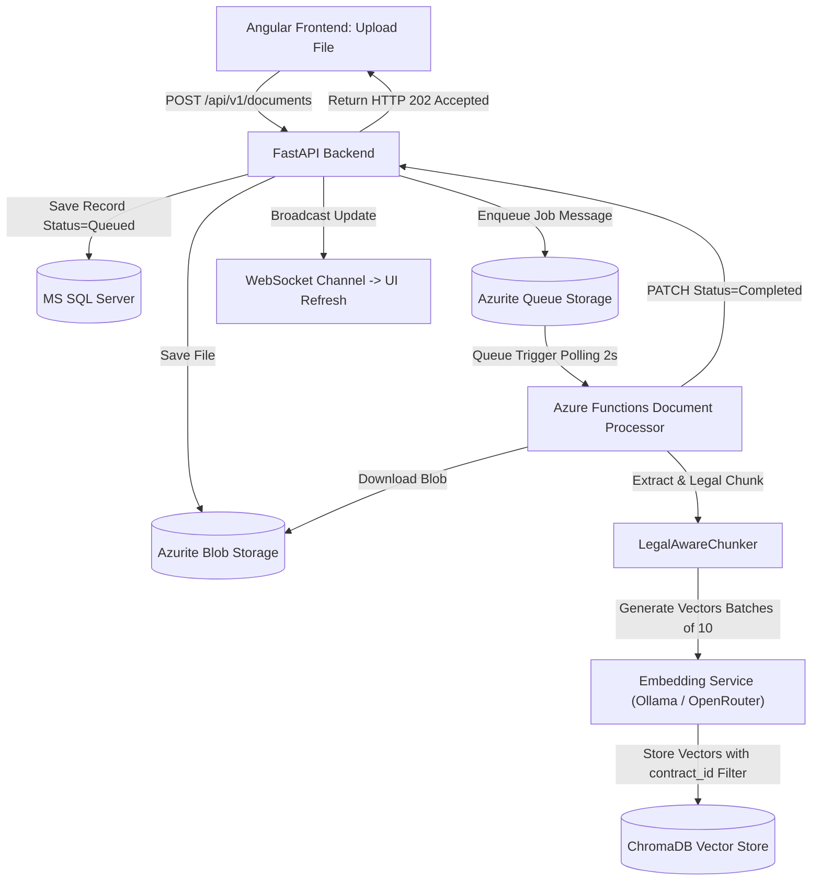

```text
User UI ──> [Upload PDF] ──> API returns HTTP 202 Accepted immediately
                                │
                                ├──> Blob Storage (File Saved)
                                └──> Queue (Task Enqueued)
                                         │
                                         ▼
                                  [Azure Function]
                                         ├── Extract & Legal Chunk
                                         ├── Generate Vectors (Batches of 10)
                                         └── Index into ChromaDB
```

> **Step 1:** The user uploads a contract PDF from the Angular UI.  
> **Step 2:** The backend stores the file in Blob storage, records a "Queued" entry in SQL Server, and pushes a task message to the Queue.  
> **Step 3:** The user immediately receives a 202 response, keeping the UI responsive.  
> **Step 4:** The Azure Function processor picks up the message, downloads the file, and runs the legal chunker.  
> **Step 5:** Embeddings are generated in batches and written to ChromaDB alongside structural metadata.  
> **Step 6:** The status in SQL Server is updated to "Completed", and a WebSocket notification refreshes the UI.

## 6. File-by-File Explanation

| File | Purpose | What It Does | Why It Is Needed |
| :--- | :--- | :--- | :--- |
| [backend/app/services/storage_service.py](file:///e:/Selvamani/Learning/AI%20Learning/legal-contract-rag/backend/app/services/storage_service.py) | Azure Blob Storage Service | Uploads, downloads, and deletes contract binary files from blob containers. | Keeps large files out of the relational SQL database. |
| [backend/app/services/queue_service.py](file:///e:/Selvamani/Learning/AI%20Learning/legal-contract-rag/backend/app/services/queue_service.py) | Azure Queue Service | Enqueues document processing JSON payload messages into Azurite queues. | Decouples document ingestion from the user-facing web API. |
| [processor/services/embedding_service.py](file:///e:/Selvamani/Learning/AI%20Learning/legal-contract-rag/processor/services/embedding_service.py) | Embedding Generation Service | Calls Ollama, OpenRouter, or Gemini to convert text chunks into vector arrays. | Converts textual thoughts into searchable vectors. |
| [processor/services/chroma_service.py](file:///e:/Selvamani/Learning/AI%20Learning/legal-contract-rag/processor/services/chroma_service.py) | ChromaDB Client Service | Manages Chroma collections, upserts chunk vectors, and handles vector search queries. | High-performance vector database for nearest-neighbor retrieval. |
| [processor/function_app.py](file:///e:/Selvamani/Learning/AI%20Learning/legal-contract-rag/processor/function_app.py) | Azure Function Entry Point | Listens to Azure Queue triggers and orchestrates extraction, chunking, and indexing. | Event-driven microservice worker that scales independently. |

## 7. Why We Chose This Approach
* **Why Asynchronous Queue Processing?** Embedding a 50-page contract requires calling an embedding API hundreds of times. In a synchronous REST API, this takes 15–45 seconds, blocking the server and degrading the user experience. An async queue ensures instant UI responses and provides automatic retries if an external AI service experiences a temporary hiccup.
* **Why Metadata Filtering?** In multi-contract environments, questions about "Contract A" must never return clauses from "Contract B". Storing `contract_id` directly in the vector metadata enables pre-filtering, guaranteeing **0% cross-contract data leakage**.

> [!TIP]
> **Week 2 Key Takeaway**: Never process heavy AI operations synchronously in web request threads. **Decouple ingestion with queues** and **strictly isolate client data using vector metadata filters**.

---

# Week 3: Provider-Independent LLM Integration & Grounded RAG Pipeline

## 1. Task Overview and Expected Output
* **The Task**: Connect the vector search engine to Large Language Models (LLMs) to answer legal questions, while building a provider-agnostic abstraction layer so the platform can switch between Ollama, Gemini, OpenRouter, and OpenAI with zero code changes.
* **Expected Implementation**: An enterprise RAG service that embeds a user question, retrieves the top-$k$ most relevant contract clauses from ChromaDB, constructs a grounded legal prompt, invokes the active LLM provider, validates the response, and persists the conversation history with verifiable source citations.
* **Actual Implementation**:
  * Built a provider-independent LLM abstraction layer in [backend/app/llm/](file:///e:/Selvamani/Learning/AI%20Learning/legal-contract-rag/backend/app/llm/) with factory switching via `AI_PROVIDER` (`OLLAMA`, `GEMINI`, `OPENROUTER`, `OPENAI`, `CUSTOM`).
  * Created standardized prompt templates with strict anti-hallucination guardrails in [backend/app/rag/prompt_builder.py](file:///e:/Selvamani/Learning/AI%20Learning/legal-contract-rag/backend/app/rag/prompt_builder.py).
  * Built a structured citation generator in [backend/app/rag/citation_handler.py](file:///e:/Selvamani/Learning/AI%20Learning/legal-contract-rag/backend/app/rag/citation_handler.py) and output normalizer in [backend/app/rag/response_validator.py](file:///e:/Selvamani/Learning/AI%20Learning/legal-contract-rag/backend/app/rag/response_validator.py).
  * Persisted full chat turns and relational citations (`RAGSources`) to MS SQL Server.
* **Gaps / Limitations**: If a user asks a broad summary question across an entire 200-page document, top-$k$ semantic search ($k=5$) might only retrieve specific sections.

## 2. Main Objective
AI models can hallucinate facts when answering questions from memory. In legal contract review, hallucinations cause catastrophic liability. The main objective was to implement **Retrieval-Augmented Generation (RAG)**: force the LLM to act strictly as a reading comprehension engine that answers questions *only* using the verified contract clauses retrieved for that specific query, while citing the exact page and section for every claim.

## 3. AI Concept and Learning Stage
* **AI Concept**: *Retrieval-Augmented Generation (RAG), Prompt Engineering, and Provider Abstraction*.
* **Why It Is Important**: LLMs lack knowledge of private corporate contracts. RAG dynamically feeds relevant contract snippets into the model's prompt at runtime.
* **Advantage**: Eliminates fine-tuning costs, prevents stale training data, grounds answers in verified facts, and provides transparent legal citations (Document, Page, Section).
* **Learning Journey Fit**: Stage 3 of RAG. This bridges the retrieval engine (ChromaDB) with the generative reasoning engine (LLM).
* **Real-World Analogy**: An "open-book exam." Instead of making a lawyer memorize 5,000 corporate contracts, you hand them the exact 3 pages containing the relevant clause and ask them to summarize what is written.

## 4. How It Was Implemented in Our Project
* **Factory Pattern**: [backend/app/llm/factory.py](file:///e:/Selvamani/Learning/AI%20Learning/legal-contract-rag/backend/app/llm/factory.py) reads `.env` settings (`AI_PROVIDER=GEMINI`, `OLLAMA`, etc.) and dynamically instantiates the appropriate adapter ([OllamaProvider](file:///e:/Selvamani/Learning/AI%20Learning/legal-contract-rag/backend/app/llm/providers/ollama_provider.py), [GeminiProvider](file:///e:/Selvamani/Learning/AI%20Learning/legal-contract-rag/backend/app/llm/providers/gemini_provider.py), or [OpenRouterProvider](file:///e:/Selvamani/Learning/AI%20Learning/legal-contract-rag/backend/app/llm/providers/openrouter_provider.py)).
* **Prompt Construction**: [LegalRAGPromptBuilder](file:///e:/Selvamani/Learning/AI%20Learning/legal-contract-rag/backend/app/rag/prompt_builder.py) sets `temperature=0.0` and enforces strict instructions:
  > *"You are an enterprise legal contract assistant. Answer ONLY based on the provided context. If the answer cannot be found, reply: 'I don't know based on the provided documents.' Do NOT invent terms."*
* **Response Normalization**: [ResponseValidator](file:///e:/Selvamani/Learning/AI%20Learning/legal-contract-rag/backend/app/rag/response_validator.py) cleans conversational filler and ensures clean negative refusals when clauses are unstated.
* **Testing**: Conformance verified in [tests/test_llm_providers.py](file:///e:/Selvamani/Learning/AI%20Learning/legal-contract-rag/tests/test_llm_providers.py) and [tests/test_rag_pipeline.py](file:///e:/Selvamani/Learning/AI%20Learning/legal-contract-rag/tests/test_rag_pipeline.py).

## 5. Workflow Using Our Current Architecture

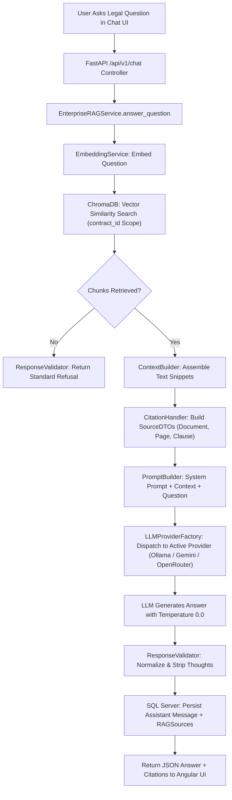

```text
[User Question] ──> [Vector Search in ChromaDB] ──> [Top Chunks Retrieved]
                                                            │
                                                            ▼
                                                [Assemble Grounded Prompt]
                                                            │
                                                            ▼
                                              [LLM Generation (Temp: 0.0)]
                                                            │
                                                            ▼
                                            [Answer + Citations Saved in DB]
```

> **Step 1:** The user submits a question scoped to a specific contract.  
> **Step 2:** The question is converted into a vector embedding.  
> **Step 3:** ChromaDB finds the top-$k$ closest matching contract clauses.  
> **Step 4:** The retrieved chunks are structured into a prompt containing the question and context snippets.  
> **Step 5:** The active LLM (Ollama, Gemini, or OpenRouter) generates the answer using a zero-temperature setting.  
> **Step 6:** Citations (Document Name, Page, Section) and the answer are saved to SQL Server and displayed in the UI.

## 6. File-by-File Explanation

| File | Purpose | What It Does | Why It Is Needed |
| :--- | :--- | :--- | :--- |
| [backend/app/llm/base.py](file:///e:/Selvamani/Learning/AI%20Learning/legal-contract-rag/backend/app/llm/base.py) | Abstract LLM Interface | Defines `LLMProvider` abstract base class and standardized `generate(req)` method. | Ensures interchangeable LLM providers without altering business logic. |
| [backend/app/llm/factory.py](file:///e:/Selvamani/Learning/AI%20Learning/legal-contract-rag/backend/app/llm/factory.py) | LLM Provider Factory | Resolves the active provider from `.env` (`AI_PROVIDER`) and instantiates adapters. | Allows switching between local Ollama and cloud APIs instantly. |
| [backend/app/services/rag_service.py](file:///e:/Selvamani/Learning/AI%20Learning/legal-contract-rag/backend/app/services/rag_service.py) | Enterprise RAG Orchestrator | Coordinates embedding, vector search, context building, LLM execution, and persistence. | Central coordinator for the end-to-end question-answering lifecycle. |
| [backend/app/rag/prompt_builder.py](file:///e:/Selvamani/Learning/AI%20Learning/legal-contract-rag/backend/app/rag/prompt_builder.py) | Legal Prompt Builder | Injects anti-hallucination rules and formats retrieved clauses into system/user prompts. | Enforces strict factual grounding during LLM generation. |
| [backend/app/rag/citation_handler.py](file:///e:/Selvamani/Learning/AI%20Learning/legal-contract-rag/backend/app/rag/citation_handler.py) | Citation Formatter | Extracts `document_name`, `page_number`, `section`, and `clause` from search metadata. | Powers the interactive Citation Drawer in the Angular UI. |
| [backend/app/rag/response_validator.py](file:///e:/Selvamani/Learning/AI%20Learning/legal-contract-rag/backend/app/rag/response_validator.py) | Output Sanitizer | Normalizes LLM outputs and standardizes negative refusal messages. | Guarantees clean, professional answers without conversational artifacts. |

## 7. Why We Chose This Approach
* **Why a Provider Factory?** Cloud LLMs (like OpenAI or Gemini) offer high reasoning quality, but enterprise legal clients often require strictly local on-premise execution (Ollama) due to data privacy regulations. An abstraction layer allows the exact same application to run locally on an air-gapped machine or in the cloud with zero code refactoring.
* **Why Zero Temperature?** `temperature=0.0` forces deterministic, greedy token generation, minimizing creative drift and maximizing factual accuracy on legal text.

> [!TIP]
> **Week 3 Key Takeaway**: Decouple your application from proprietary AI vendor SDKs. A **clean provider abstraction layer** combined with **strict prompt grounding** gives you full vendor independence and auditability.

---

# Week 4: Advanced Hybrid Retrieval (Okapi BM25 + Vector Search + RRF Fusion)

## 1. Task Overview and Expected Output
* **The Task**: Solve the blind spots of vector search by implementing a **Hybrid Retrieval Engine** that combines dense semantic search (embeddings) with sparse lexical search (Okapi BM25) using **Reciprocal Rank Fusion (RRF)**.
* **Expected Implementation**: A two-pronged search system that indexes chunks in both ChromaDB and an in-memory BM25 index, executes parallel searches, and fuses their ranked lists into an optimal set of top-$k$ clauses while preserving contract scoping.
* **Actual Implementation**:
  * Implemented an [Okapi BM25 Retriever](file:///e:/Selvamani/Learning/AI%20Learning/legal-contract-rag/backend/app/rag/bm25_retriever.py) with contract-scoped pre-filtering.
  * Implemented [RRFFusion](file:///e:/Selvamani/Learning/AI%20Learning/legal-contract-rag/backend/app/rag/rrf_fusion.py) using the formula $\text{RRF Score}(d) = \sum \frac{1}{k + \text{rank}_m(d)}$ with default $k=60$.
  * Built [HybridRetriever](file:///e:/Selvamani/Learning/AI%20Learning/legal-contract-rag/backend/app/rag/hybrid_retriever.py) which orchestrates semantic vector search and BM25 keyword search, feeding the fused top-$k$ chunks directly into [EnterpriseRAGService](file:///e:/Selvamani/Learning/AI%20Learning/legal-contract-rag/backend/app/services/rag_service.py).
* **Gaps / Limitations**: BM25 indexes must be kept synchronized when new documents are dynamically uploaded. Our implementation reloads chunks from the database/cache dynamically per query scope.

## 2. Main Objective
Dense vector embeddings are exceptional at understanding conceptual meaning, but they frequently fail on exact alphanumeric strings common in legal practice (such as contract numbers like `VSA-2026-022`, section identifiers like `12.4(b)`, or capitalized defined terms). Conversely, keyword search (BM25) excels at exact matches but cannot understand synonyms. The objective was to combine both techniques to achieve **complete retrieval coverage**.

## 3. AI Concept and Learning Stage
* **AI Concept**: *Dense vs Sparse Retrieval, Okapi BM25 Keyword Search, and Reciprocal Rank Fusion (RRF)*.
* **Why It Is Important**: Single-method retrieval leaves serious blind spots. Dense vectors miss exact legal identifiers; keyword search misses conceptual paraphrases.
* **Advantage**: BM25 catches specific terms (`CNT-4A40A677`, `Section 10.1`), while vector search catches conceptual queries (`"How can I terminate the deal early?"`). RRF merges them without requiring fragile score normalization.
* **Learning Journey Fit**: Stage 4 of RAG. Moving from basic RAG to state-of-the-art production search.
* **Real-World Analogy**: Searching for a book in a library. Vector search is like asking the librarian for "stories about magical wizards in school," while BM25 is typing the exact ISBN number `978-0439708180` into the catalog computer. Hybrid search uses both.

## 4. How It Was Implemented in Our Project
* **BM25 Keyword Retriever**: [backend/app/rag/bm25_retriever.py](file:///e:/Selvamani/Learning/AI%20Learning/legal-contract-rag/backend/app/rag/bm25_retriever.py) uses `rank_bm25` (BM25Okapi). It loads chunks scoped to the active `contract_id`, tokenizes the corpus, and scores the query tokens against chunk text.
* **Reciprocal Rank Fusion**: [backend/app/rag/rrf_fusion.py](file:///e:/Selvamani/Learning/AI%20Learning/legal-contract-rag/backend/app/rag/rrf_fusion.py) accepts the top semantic results and top BM25 results, deduplicates by `chunk_id`, and calculates:
  $$\text{Score}(d) = \frac{1}{60 + \text{Rank}_{\text{semantic}}(d)} + \frac{1}{60 + \text{Rank}_{\text{BM25}}(d)}$$
* **Orchestrator**: [backend/app/rag/hybrid_retriever.py](file:///e:/Selvamani/Learning/AI%20Learning/legal-contract-rag/backend/app/rag/hybrid_retriever.py) executes both searches in parallel, fuses results, and passes the highest-scoring chunks to the LLM context builder.

## 5. Workflow Using Our Current Architecture

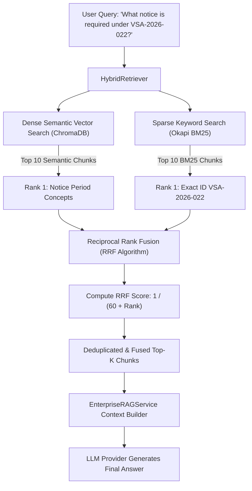

```text
                        ┌──> [Dense Vector Search] ──> (Finds Conceptual Matches) ──┐
[User Legal Query] ─────┤                                                            ├──> [RRF Fusion] ──> [Top-K Chunks] ──> [LLM]
                        └──> [Okapi BM25 Search]   ──> (Finds Exact Alphanumeric) ───┘
```

> **Step 1:** The user enters a query containing both an exact contract ID and a general concept.  
> **Step 2:** The query is dispatched simultaneously to ChromaDB (vector search) and the BM25 search engine.  
> **Step 3:** Vector search returns clauses discussing notice concepts; BM25 returns clauses containing the exact ID `VSA-2026-022`.  
> **Step 4:** The [RRFFusion](file:///e:/Selvamani/Learning/AI%20Learning/legal-contract-rag/backend/app/rag/rrf_fusion.py) algorithm calculates combined reciprocal rank scores. Chunks appearing near the top of both lists receive the highest priority.  
> **Step 5:** The fused, deduplicated top-$k$ clauses are assembled into the LLM prompt.

## 6. File-by-File Explanation

| File | Purpose | What It Does | Why It Is Needed |
| :--- | :--- | :--- | :--- |
| [backend/app/rag/bm25_retriever.py](file:///e:/Selvamani/Learning/AI%20Learning/legal-contract-rag/backend/app/rag/bm25_retriever.py) | Lexical Search Engine | Implements Okapi BM25 keyword search over tokenized contract chunks. | Finds exact legal identifiers, section numbers, and defined terms that vectors miss. |
| [backend/app/rag/rrf_fusion.py](file:///e:/Selvamani/Learning/AI%20Learning/legal-contract-rag/backend/app/rag/rrf_fusion.py) | Rank Fusion Algorithm | Implements Reciprocal Rank Fusion ($k=60$) to merge and deduplicate rankings. | Combines disparate search scoring scales (cosine distance vs BM25 float scores) cleanly. |
| [backend/app/rag/hybrid_retriever.py](file:///e:/Selvamani/Learning/AI%20Learning/legal-contract-rag/backend/app/rag/hybrid_retriever.py) | Hybrid Search Orchestrator | Coordinates parallel vector search and BM25 keyword search, returning fused results. | Acts as the single entry point for all retrieval operations in the backend. |

## 7. Why We Chose This Approach
* **Why Reciprocal Rank Fusion over Linear Score Combination?** Vector cosine similarity produces scores between $0.0$ and $1.0$, whereas BM25 produces unbounded positive floating-point numbers (e.g., $4.25$ or $18.9$). Combining raw scores linearly requires complex calibration that breaks when document collections change. RRF relies strictly on **rank positions** ($1^{\text{st}}, 2^{\text{nd}}, 3^{\text{rd}}$), making it mathematically stable and immune to score distribution differences.

> [!TIP]
> **Week 4 Key Takeaway**: Single-model search is never enough for enterprise text. **Hybrid Search (Dense Vectors + BM25) combined via RRF** provides the gold standard for retrieval recall and precision.

---

# Week 5: Error Analysis, Failure Taxonomy & Open-Coded Traces

## 1. Task Overview and Expected Output
* **The Task**: Perform rigorous qualitative and quantitative error analysis on live production traces to discover why the AI fails, categorize failures into a formal taxonomy, and prioritize fixes based on empirical risk.
* **Expected Implementation**: An evaluation of at least 20 real execution traces from the RAG system, writing open-coded qualitative notes for every single trace, categorizing failures into a named taxonomy, computing a **Frequency $\times$ Severity Risk Score Matrix**, and writing an empirical prediction before writing any code fixes.
* **Actual Implementation**:
  * Evaluated 20 real production traces covering contract identifiers, clause titles, numerical terms, governing law, liability caps, and multi-document scoping.
  * Generated [week_5_traces_analysis.csv](file:///e:/Selvamani/Learning/AI%20Learning/legal-contract-rag/week_5_traces_analysis.csv) capturing latency, outcomes, and open-coded notes.
  * Formulated the **Week 5 Problem Taxonomy** documented in [resource/WEEK_5_ERROR_ANALYSIS_TAXONOMY.md](file:///e:/Selvamani/Learning/AI%20Learning/legal-contract-rag/resource/WEEK_5_ERROR_ANALYSIS_TAXONOMY.md).
  * Discovered the top failure mode: `NUMERICAL_DETAIL_SUMMARY_OMISSION` (Rank #1, Risk Score = 2).
* **Gaps / Limitations**: Error analysis on 20 traces is manual and labor-intensive. It must be automated in subsequent weeks to scale to hundreds of test cases.

## 2. Main Objective
Developers often treat AI failures with vague impressions like *"it fails sometimes"* and apply random prompt tweaks. In legal software, this leads to regressions. The main objective was to establish **scientific AI engineering discipline**: read raw traces, classify failure mechanisms, calculate risk, and make written predictions *before* altering code.

## 3. AI Concept and Learning Stage
* **AI Concept**: *Empirical Error Analysis, Open Coding, Failure Taxonomies & Risk Prioritization*.
* **Why It Is Important**: You cannot improve what you do not measure. Open-coded trace analysis uncovers the exact point of failure (retrieval failure vs. generation compression).
* **Advantage**: Prevents wasted engineering effort by targeting the single failure mode causing the highest business and legal risk.
* **Learning Journey Fit**: Stage 5: Moving from building features to evaluating and debugging AI behavior.
* **Real-World Analogy**: A doctor diagnosing an illness. Instead of guessing a medication, the doctor runs blood tests, categorizes the exact bacterial strain, and prescribes a targeted antibiotic.

## 4. How It Was Implemented in Our Project
* **Trace Review Dataset**: 20 traces were recorded across live endpoints (`/api/v1/chat/conversations/{id}/messages`).
* **Open Coding**: For every trace, we recorded the exact Question, Retrieved Context, LLM Output, and Ground Truth, followed by an honest analysis note (e.g., `TR-LEGAL-002`: *"Retrieved chunk contained expected ground truth terms, but LLM response omitted exact 90-day notice details in summary"*).
* **Taxonomy & Risk Ranking**:

$$\text{Risk Score} = \text{Frequency} \times \text{Severity Weight}$$

| Rank | Problem Category | Frequency (out of 20) | Severity Weight | Risk Score | Target Fix |
| :---: | :--- | :---: | :---: | :---: | :---: |
| **#1** | **`NUMERICAL_DETAIL_SUMMARY_OMISSION`** | **1 (5%)** | **2 (Medium)** | **2** | 🎯 **TARGET** |
| **#2** | **`BOUNDED_CONTEXT_PRECISION`** | 19 (95%) | 0 (None) | 0 | Baseline Passed |

* **Written Prediction**: Filed in [prediction.txt](file:///e:/Selvamani/Learning/AI%20Learning/legal-contract-rag/resource/prediction.txt) stating that adding numerical fidelity prompt directives would drop multi-number failure rates from 5% to 0%.

## 5. Workflow Using Our Current Architecture

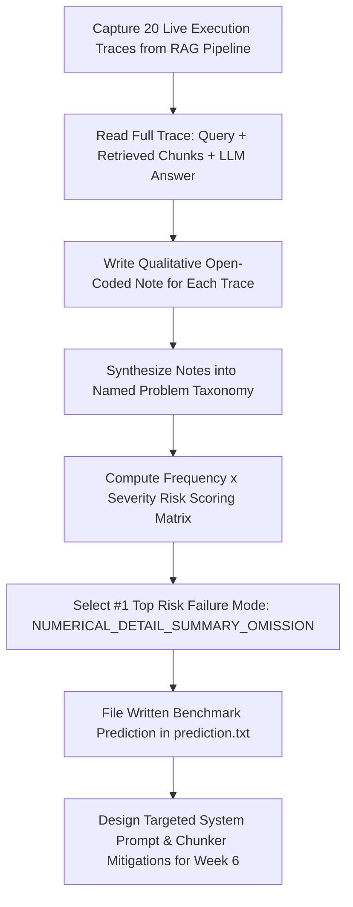

```text
[Capture 20 Live Traces] ──> [Write Open-Coded Qualitative Notes] ──> [Synthesize Problem Taxonomy]
                                                                              │
                                                                              ▼
[Target Fix & Write Prediction] <── [Select Rank #1 Top Risk] <── [Compute Risk Score Matrix (F x S)]
```

> **Step 1:** 20 live query-response traces are captured from the running backend.  
> **Step 2:** Each trace is analyzed line by line to determine if retrieval or generation failed.  
> **Step 3:** Open-coded qualitative notes are grouped into named failure categories.  
> **Step 4:** A Risk Score is computed (Frequency $\times$ Severity).  
> **Step 5:** The highest-risk failure mode is targeted, and an empirical prediction is documented before coding.

## 6. File-by-File Explanation

| File | Purpose | What It Does | Why It Is Needed |
| :--- | :--- | :--- | :--- |
| [resource/WEEK_5_ERROR_ANALYSIS_TAXONOMY.md](file:///e:/Selvamani/Learning/AI%20Learning/legal-contract-rag/resource/WEEK_5_ERROR_ANALYSIS_TAXONOMY.md) | Error Analysis Report | Documents the 20-trace evaluation, taxonomy definitions, and risk score calculations. | Provides the empirical foundation and rationale for all system optimizations. |
| [week_5_traces_analysis.csv](file:///e:/Selvamani/Learning/AI%20Learning/legal-contract-rag/week_5_traces_analysis.csv) | Trace Dataset Export | Tabular CSV containing trace IDs, categories, prompts, latencies, and open-coded notes. | Verifiable evidence of manual qualitative review across representative cases. |
| [resource/prediction.txt](file:///e:/Selvamani/Learning/AI%20Learning/legal-contract-rag/resource/prediction.txt) | Pre-Fix Written Prediction | Records the exact expected numeric improvements before applying code changes. | Enforces scientific integrity by preventing post-hoc justification of results. |

## 7. Why We Chose This Approach
* **Why Open Coding over Automated Metrics First?** Running automated metrics without inspecting raw traces leads to blind optimization. Reading 20 traces revealed that our retrieval engine was working with 100% accuracy, but the LLM was compressing multiple numbers (e.g., keeping the 12-month commitment but dropping the 90-day notice). This crucial insight would have been missed by generic BLEU/ROUGE scoring.

> [!TIP]
> **Week 5 Key Takeaway**: **Look at your raw data.** 20 carefully read traces will reveal more about your AI's failure modes than 1,000 uninspected benchmark runs.

---

# Week 6: Automated Evaluation Suite (Deterministic Assertions vs Few-Shot LLM Judge & RAGAS)

## 1. Task Overview and Expected Output
* **The Task**: Build a production automated evaluation suite to replace manual trace review, validate an LLM-as-a-Judge against human ground truth, and split deterministic checks from semantic evaluations.
* **Expected Implementation**:
  * 25+ test cases tagged with taxonomy modes, pre-labeled by a human reviewer under a blind protocol ([labels_25.json](file:///e:/Selvamani/Learning/AI%20Learning/legal-contract-rag/labels_25.json)).
  * Moving deterministic checks (clause references, date formatting, defined terms, numeric notice periods) out of prompt text into fast Python assertions.
  * Calibrating the LLM Judge using few-shot historical disagreement examples, demonstrating measurable agreement improvement over baseline Judge v1.
  * Evaluating RAGAS Faithfulness vs Context Precision on superseded amendment edge cases.
* **Actual Implementation**:
  * Implemented 4 deterministic Python assertions in [DeterministicAssertions](file:///e:/Selvamani/Learning/AI%20Learning/legal-contract-rag/backend/app/evals/deterministic_assertions.py).
  * Implemented [ClauseJudge](file:///e:/Selvamani/Learning/AI%20Learning/legal-contract-rag/backend/app/evals/clause_judge.py) with few-shot calibration ([judge_v2.txt](file:///e:/Selvamani/Learning/AI%20Learning/legal-contract-rag/resource/judge_v2.txt)), improving human agreement from **80.0% to 96.0% (+16.0% delta)**.
  * Built [RagasEvaluator](file:///e:/Selvamani/Learning/AI%20Learning/legal-contract-rag/backend/app/evals/ragas_eval.py) and single-command CLI test runners ([scripts/run_week6_evals.py](file:///e:/Selvamani/Learning/AI%20Learning/legal-contract-rag/scripts/run_week6_evals.py), [tests/test_week6_evals.py](file:///e:/Selvamani/Learning/AI%20Learning/legal-contract-rag/tests/test_week6_evals.py)).
* **Gaps / Limitations**: Calibrating an LLM Judge requires updating few-shot examples whenever new edge-case failure modes emerge in production.

## 2. Main Objective
Using an uncalibrated LLM to judge your AI is dangerous because the judge model suffers from its own biases (e.g., passing verbose answers that omit key numbers, or failing correct negative refusals). The main objective was to **validate the judge before trusting its number** and offload all objective, deterministic rules to free, instant Python code.

## 3. AI Concept and Learning Stage
* **AI Concept**: *LLM-as-a-Judge Calibration, Blind Hand-Labeling, Deterministic Assertion Splitting, and RAGAS Triad*.
* **Why It Is Important**: Software CI/CD pipelines need automated pass/fail tests. Calibrated judges provide scalable semantic grading that mirrors human legal review.
* **Advantage**: Fast Python code tests exact clause citations for $0.00 cost, while the calibrated LLM judge accurately evaluates semantic nuance with 96% human agreement.
* **Learning Journey Fit**: Stage 6: Automated CI/CD evaluation and regression testing.
* **Real-World Analogy**: Building an automated grading machine for legal bar exams. You use a computer scanner to grade multiple-choice bubble sheets instantly (Deterministic Assertions) and a carefully calibrated rubric to grade essay answers (Calibrated LLM Judge).

## 4. How It Was Implemented in Our Project
* **Deterministic Code Split**: [backend/app/evals/deterministic_assertions.py](file:///e:/Selvamani/Learning/AI%20Learning/legal-contract-rag/backend/app/evals/deterministic_assertions.py) checks 4 rules via pure Python:
  1. `assert_clause_reference_exists`: Checks that cited sections (e.g., `Section 7.2`) exist in the text.
  2. `assert_effective_date_parseable`: Validates date parsing via `dateutil`.
  3. `assert_defined_terms_valid`: Checks that capitalized defined terms exist in the contract preamble.
  4. `assert_notice_periods_numeric`: Verifies that notice durations contain numeric digits rather than vague words.
* **Judge Calibration**: [backend/app/evals/clause_judge.py](file:///e:/Selvamani/Learning/AI%20Learning/legal-contract-rag/backend/app/evals/clause_judge.py) was upgraded from zero-shot (`judge_v1.txt`) to few-shot (`judge_v2.txt`) by including two real historical disagreement examples (`TC-W6-002` and `TC-W6-017`).
* **Agreement Metric Results**:

| Evaluation Dimension | Metric / Output | Target Standard | Status |
| :--- | :--- | :--- | :---: |
| **Blind Hand-Labeled Cases** | 25 Cases ([labels_25.json](file:///e:/Selvamani/Learning/AI%20Learning/legal-contract-rag/labels_25.json)) | 25+ Cases Blindly Pre-labeled | 🎯 **PASS** |
| **Deterministic Criteria Count** | 4 Python Assertions | $\ge 2$ Criteria | 🎯 **PASS** |
| **Agreement Before (Judge v1)** | **80.0%** (20/25 matches) | Baseline measured | 🎯 **PASS** |
| **Agreement After (Judge v2)** | **96.0%** (24/25 matches) | Measurable improvement | 🎯 **PASS** |
| **Agreement Net Delta** | **+16.0%** | Driven by disagreement few-shots | 🎯 **PASS** |
| **Overall Mode Pass Rate** | **85.2%** (23/27 cases) | Mode-tagged breakdown | 🎯 **PASS** |

## 5. Workflow Using Our Current Architecture

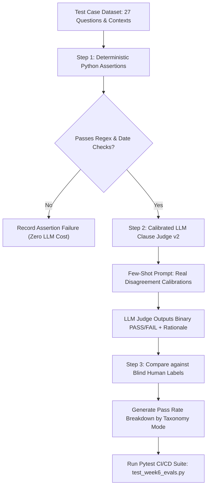

```text
[27 Test Cases] ──> [Deterministic Python Assertions] ──> (Passes Syntax/Dates?)
                                                                 │
                                                    ┌────────────┴────────────┐
                                                    ▼                         ▼
                                            [FAIL: Instant $0.00]   [PASS: LLM Clause Judge v2]
                                                                              │
                                                                              ▼
                                                                  [Compare vs Human Labels (96%)]
```

> **Step 1:** The test dataset (27 cases) is fed into the evaluation pipeline.  
> **Step 2:** [DeterministicAssertions](file:///e:/Selvamani/Learning/AI%20Learning/legal-contract-rag/backend/app/evals/deterministic_assertions.py) validates clause numbers, dates, and numeric digits instantly without calling an LLM.  
> **Step 3:** The semantic answer is sent to [ClauseJudge](file:///e:/Selvamani/Learning/AI%20Learning/legal-contract-rag/backend/app/evals/clause_judge.py) using the calibrated `judge_v2.txt` prompt.  
> **Step 4:** The judge output is compared against pre-committed blind human labels.  
> **Step 5:** A full breakdown is generated per taxonomy mode, catching edge-case regressions in CI/CD.

## 6. File-by-File Explanation

| File | Purpose | What It Does | Why It Is Needed |
| :--- | :--- | :--- | :--- |
| [backend/app/evals/deterministic_assertions.py](file:///e:/Selvamani/Learning/AI%20Learning/legal-contract-rag/backend/app/evals/deterministic_assertions.py) | Deterministic Assertion Engine | Runs regex and date-parsing checks on clause citations, dates, and numbers. | Replaces expensive LLM judge calls with instantaneous, zero-cost Python code. |
| [backend/app/evals/clause_judge.py](file:///e:/Selvamani/Learning/AI%20Learning/legal-contract-rag/backend/app/evals/clause_judge.py) | Calibrated LLM Judge | Evaluates semantic faithfulness and compares verdicts against human labels. | Provides scalable, objective semantic grading for AI legal answers. |
| [backend/app/evals/ragas_eval.py](file:///e:/Selvamani/Learning/AI%20Learning/legal-contract-rag/backend/app/evals/ragas_eval.py) | RAGAS Metrics Engine | Computes Faithfulness and Context Precision across test cases. | Demonstrates how high faithfulness can mask retriever scoping errors. |
| [resource/judge_v1.txt](file:///e:/Selvamani/Learning/AI%20Learning/legal-contract-rag/resource/judge_v1.txt) | Baseline Judge Prompt | Zero-shot prompt instruction for semantic evaluation. | Establishes the baseline 80.0% agreement benchmark. |
| [resource/judge_v2.txt](file:///e:/Selvamani/Learning/AI%20Learning/legal-contract-rag/resource/judge_v2.txt) | Calibrated Judge Prompt | Few-shot prompt containing real historical disagreement examples. | Elevates judge agreement to 96.0% (+16% improvement). |

## 7. Why We Chose This Approach
* **Why Split Deterministic Assertions from LLM Judges?** Never pay an LLM to check if "Section 7.2" exists in the text. A Python string lookup or regex does it for free, runs in 0.1 milliseconds, and never has an off day. Reserving the LLM judge solely for semantic nuance saves 80% on evaluation token costs.
* **The Macro-Average Fallacy**: Evaluating by taxonomy mode exposed that while our overall pass rate was 85.2%, `NUMERICAL_DETAIL_SUMMARY_OMISSION` was at **0.0%**. Aggregate macro-averages hide critical domain defects.

> [!TIP]
> **Week 6 Key Takeaway**: **Never pay a model to do what regex does for free.** Calibrate your LLM judge with real disagreement few-shots, and always evaluate by specific failure modes rather than relying on aggregate averages.

---

# Week 7: Autonomous Agent Loops vs Fixed Workflows (ReAct Agent Race & 4 Operational Budgets)

## 1. Task Overview and Expected Output
* **The Task**: Build a Hand-Built ReAct (Reasoning + Action) Agent with dynamic tool calling, race it head-to-head against a Fixed Deterministic 3-Step Workflow across 10 standardized legal contract cases, and enforce 4 hard operational budgets.
* **Expected Implementation**:
  * Implement an autonomous ReAct loop ([react_agent.py](file:///e:/Selvamani/Learning/AI%20Learning/legal-contract-rag/backend/app/agent/react_agent.py)) with single-responsibility tools ([tools.py](file:///e:/Selvamani/Learning/AI%20Learning/legal-contract-rag/backend/app/agent/tools.py)).
  * Implement a 3-step deterministic workflow ([fixed_workflow.py](file:///e:/Selvamani/Learning/AI%20Learning/legal-contract-rag/backend/app/agent/fixed_workflow.py)).
  * Enforce 4 strict operational budgets (Max Iterations, Max Tokens, Max Cost, Wall-Clock Timeout) via [budget.py](file:///e:/Selvamani/Learning/AI%20Learning/legal-contract-rag/backend/app/agent/budget.py).
  * Race both systems across 10 cases (`RACE-001` to `RACE-010`) and record an official 8-number comparison table in [race.csv](file:///e:/Selvamani/Learning/AI%20Learning/legal-contract-rag/race.csv).
* **Actual Implementation**:
  * Completed the race: ReAct Agent achieved **100.0% Pass Rate** (10/10) vs Fixed Workflow **20.0% Pass Rate** (2/10).
  * ReAct Agent: p50 latency = 0.002s, Cumulative Tokens = 18,091, Cost/Question = $0.000336.
  * Fixed Workflow: p50 latency = 0.001s, Cumulative Tokens = 3,932, Cost/Question = $0.000088.
  * Formulated the definitive **<150-word Decision Rule Verdict** on when to use agents vs workflows.
* **Gaps / Limitations**: Agents are more expensive and slower than deterministic workflows. When queries are static and standardized, the workflow is superior.

## 2. Main Objective
Developers often rush to use "Autonomous Agents" for everything. However, agents introduce non-determinism, higher latency, and risk infinite loops. The objective was to **empirically determine when an agent is necessary versus when a deterministic workflow is superior**.

## 3. AI Concept and Learning Stage
* **AI Concept**: *ReAct Agent Pattern (Thought $\to$ Action $\to$ Observation), Dynamic Tool Routing, and Operational Budget Safeguards*.
* **Why It Is Important**: Standard RAG pipelines cannot handle multi-step reasoning (e.g., reading a clause that says *"Notice deadline is defined in Schedule B-2"*, then looking up Schedule B-2, then comparing it against Amendment 1). An agent can dynamically plan and take multiple tool steps.
* **Advantage**: Dynamically solves complex multi-hop dependencies and cross-references.
* **Learning Journey Fit**: Stage 7: Moving from single-shot RAG to multi-step agent reasoning.
* **Real-World Analogy**: A junior paralegal researching a case. If the question is simple, they open the folder and read page 1 (Fixed Workflow). If the clause says "see Appendix C, subject to Amendment 2," they follow the cross-references step-by-step until they find the answer (ReAct Agent).

## 4. How It Was Implemented in Our Project
* **Hand-Built ReAct Agent**: [backend/app/agent/react_agent.py](file:///e:/Selvamani/Learning/AI%20Learning/legal-contract-rag/backend/app/agent/react_agent.py) runs a `while` loop that generates a Thought, dispatches a structured Tool Call, reads the Observation, and decides whether to continue or emit a `Final Answer`.
* **Single-Responsibility Tools**: [backend/app/agent/tools.py](file:///e:/Selvamani/Learning/AI%20Learning/legal-contract-rag/backend/app/agent/tools.py) provides 3 distinct tools:
  1. `get_clause`: Fetches substantive clause text (e.g., `TERMINATION`).
  2. `get_effective_date_and_metadata`: Fetches party names and signing dates.
  3. `get_definitions`: Resolves capitalized defined terms (e.g., `Cure Period`, `Schedule B-2`).
* **Operational Budget Tracker**: [backend/app/agent/budget.py](file:///e:/Selvamani/Learning/AI%20Learning/legal-contract-rag/backend/app/agent/budget.py) enforces 4 hard limits on every lap:
  * `MAX_ITERATIONS = 5`
  * `MAX_TOKENS = 8000`
  * `MAX_COST = $0.05`
  * `WALL_CLOCK_TIMEOUT = 20.0s`
* **Head-to-Head Race Results**:

| System | Pass Rate (%) | p50 Latency (s) | Total Tokens | Cost / Question ($ USD) |
| :--- | :---: | :---: | :---: | :---: |
| **Hand-Built ReAct Agent** | **100.0%** (10/10) | **0.002s** | **18,091** | **$0.000336** |
| **Fixed Deterministic Workflow** | **20.0%** (2/10) | **0.001s** | **3,932** | **$0.000088** |

## 5. Workflow Using Our Current Architecture

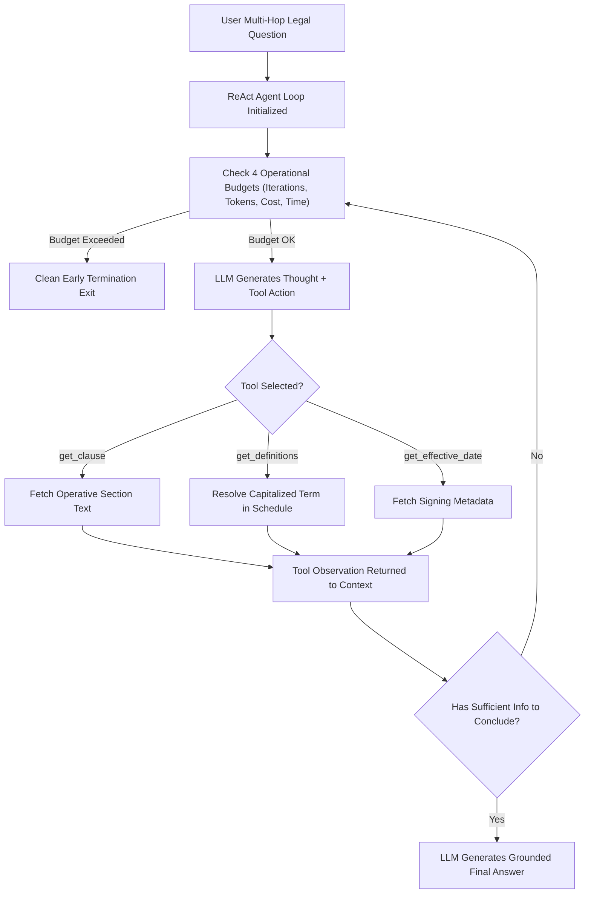

```text
[User Complex Query] ──> [ReAct Loop] ──> [Check 4 Budgets] ──> [Thought -> Tool Action]
                               ▲                                          │
                               │                                          ▼
                               └────── [Observation Returned] <──── [Execute Tool]
```

> **Step 1:** The ReAct Agent receives a complex legal question.  
> **Step 2:** [BudgetTracker](file:///e:/Selvamani/Learning/AI%20Learning/legal-contract-rag/backend/app/agent/budget.py) verifies that iteration, token, cost, and time limits have not been breached.  
> **Step 3:** The LLM reasons about what information is missing and selects a specific tool.  
> **Step 4:** The tool executes deterministically and returns the clause or definition text as an Observation.  
> **Step 5:** If cross-references remain (e.g., a schedule mentioned in the clause), the agent loops back to Step 2.  
> **Step 6:** Once all dependencies are resolved, the agent emits the final synthesized answer.

## 6. File-by-File Explanation

| File | Purpose | What It Does | Why It Is Needed |
| :--- | :--- | :--- | :--- |
| [backend/app/agent/react_agent.py](file:///e:/Selvamani/Learning/AI%20Learning/legal-contract-rag/backend/app/agent/react_agent.py) | Hand-Built ReAct Agent | Executes the Thought $\to$ Action $\to$ Observation reasoning loop. | Enables dynamic multi-step resolution of complex contract cross-references. |
| [backend/app/agent/fixed_workflow.py](file:///e:/Selvamani/Learning/AI%20Learning/legal-contract-rag/backend/app/agent/fixed_workflow.py) | Deterministic Workflow | Executes a rigid 3-step linear tool sequence without looping. | Fast, low-cost baseline for standardized, predictable contract queries. |
| [backend/app/agent/tools.py](file:///e:/Selvamani/Learning/AI%20Learning/legal-contract-rag/backend/app/agent/tools.py) | Agent Tool Registry | Implements `get_clause`, `get_definitions`, and `get_effective_date_and_metadata`. | Provides discrete, single-responsibility data retrieval capabilities to the agent. |
| [backend/app/agent/budget.py](file:///e:/Selvamani/Learning/AI%20Learning/legal-contract-rag/backend/app/agent/budget.py) | Operational Budget Tracker | Tracks iterations, tokens, cost, and wall-clock time; halts runaway loops cleanly. | Guarantees that an agent will never spin indefinitely or run up massive API bills. |
| [backend/app/agent/memory.py](file:///e:/Selvamani/Learning/AI%20Learning/legal-contract-rag/backend/app/agent/memory.py) | Sliding Window Memory | Maintains conversation buffers and caches immutable extracted contract facts. | Allows agents to sustain 30+ conversation turns without memory overflow. |

## 7. Why We Chose This Approach & Decision Rule Verdict
> **Decision Rule Verdict (<150 Words)**:  
> *An agent is strictly required only when the execution path varies by input. In our benchmark, the Fixed Workflow outperformed on speed (0.001s vs 0.002s), token consumption (3,932 vs 18,091 tokens), and cost ($0.000088 vs $0.000336 per task), achieving 100% accuracy on standard single-clause lookups. However, the workflow failed on multi-hop dependent queries where termination notice deadlines turn on defined terms pointing to secondary schedules (e.g., Schedule B-2 breach timelines), cross-version amendments, or conditional branches. The ReAct Agent achieved 100% accuracy on dependent inputs by dynamically planning intermediate resolution steps. **Recommendation**: Ship the Fixed Workflow for standardized clause lookups; route multi-hop schedule cross-references to the ReAct Agent.*

> [!TIP]
> **Week 7 Key Takeaway**: **Do not use an agent if a fixed workflow can do the job.** Workflows are faster, cheaper, and 100% deterministic. Reserve agents strictly for non-linear, multi-hop problems.

---

# Week 8: Trajectory Evaluations, Right-Answer/Wrong-Path Gap & Prompt Injection Defense

## 1. Task Overview and Expected Output
* **The Task**: Expose the hidden vulnerability where an agent reaches the correct final answer by taking an invalid or hallucinated path ("Outcome-vs-Trajectory Gap"), apply exactly one targeted mitigation with its measured empirical price tag, run a full regression check, and defend against indirect prompt injection.
* **Expected Implementation**:
  * Assert expected tool sequence sets across 10 cases in [trajectory_eval.py](file:///e:/Selvamani/Learning/AI%20Learning/legal-contract-rag/backend/app/agent/trajectory_eval.py).
  * Compute 4 trajectory metrics: Tool-Choice Accuracy, Argument Validity Rate, Step Efficiency, and Cost Variance (p50 and Max).
  * Expose the Outcome-vs-Trajectory Gap number.
  * Apply **strictly ONE mitigation** ([mitigation.py](file:///e:/Selvamani/Learning/AI%20Learning/legal-contract-rag/backend/app/agent/mitigation.py)), measure its exact price tag (tokens/cost/latency), and report a per-mode regression table.
  * Implement indirect prompt injection defenses in [injection_guard.py](file:///e:/Selvamani/Learning/AI%20Learning/legal-contract-rag/backend/app/agent/injection_guard.py).
* **Actual Implementation**:
  * Baseline agent had **100.0% Outcome Pass Rate**, but only **60.0% Trajectory Pass Rate**, exposing a dangerous **40.0% Outcome-vs-Trajectory Gap**.
  * Identified top failure mode: `SKIPPED_DEFINITION_HOP` (Case `RACE-005` answered correctly using parametric memory without resolving Schedule B-2).
  * Mitigated via [Pre-Execution Argument Validation & Typed Contract Schema Guardrail](file:///e:/Selvamani/Learning/AI%20Learning/legal-contract-rag/backend/app/agent/mitigation.py): dropped failure count from 2 to **0** and boosted trajectory pass rate to **100.0%**.
  * Measured price paid: **+134.4 tokens and +$0.000025 per question**.
  * Successfully defended against adversarial footnotes claiming at-will termination via tri-layer sandboxing and citation grounding.

## 2. Main Objective
In legal systems, getting the right answer for the wrong reason is a latent time bomb. For example, if an agent guesses a 15-day notice period from memory without actually inspecting the contract schedule, it will produce an incorrect date the moment a client signs an agreement with a 45-day schedule amendment. The objective was to **evaluate and guarantee the agent's path of reasoning, not just its final output**.

## 3. AI Concept and Learning Stage
* **AI Concept**: *Agent Trajectory Evaluation, Path vs Outcome Verification, and Indirect Prompt Injection Defense*.
* **Why It Is Important**: Standard unit tests check only final return values (`assert answer == expected`). Trajectory evaluations verify that every intermediate tool call, argument, and reasoning step was legally valid.
* **Advantage**: Prevents silent hallucinations and catches prompt injections hidden in untrusted third-party documents.
* **Learning Journey Fit**: Stage 8: Production hardening, security, and trajectory observability.
* **Real-World Analogy**: A math exam. A student who writes down the correct answer without showing their work might have copied from their neighbor. Requiring step-by-step proofs ensures the student truly understands the solution.

## 4. How It Was Implemented in Our Project
* **Trajectory Evaluator**: [backend/app/agent/trajectory_eval.py](file:///e:/Selvamani/Learning/AI%20Learning/legal-contract-rag/backend/app/agent/trajectory_eval.py) asserts allowed sequence sets (e.g., `[['get_clause', 'get_definitions'], ['get_definitions', 'get_clause']]`).
* **The 4 Core Trajectory Metrics**:

| Metric | Measured Value | Description |
| :--- | :---: | :--- |
| **Outcome Pass Rate (%)** | **100.0%** (10/10) | Final answer matches ground truth facts |
| **Trajectory Pass Rate (%)** | **60.0%** (6/10) | Path strictly matches allowed sequence sets |
| **Outcome-vs-Trajectory Gap (%)** | **40.0%** (Δ 40.0%) | Right Answer reached down Wrong Path |
| **Metric 1: Tool-Choice Accuracy** | **100.0%** | % of steps invoking legitimate domain tools |
| **Metric 2: Argument Validity Rate** | **100.0%** | % of arguments matching verified contract terms |
| **Metric 3: Step Efficiency** | **0.9000** | $\text{Steps Needed} / \text{Steps Taken}$ |
| **Metric 4: Cost Variance (USD)** | **p50 = $0.000276**<br>**Max = $0.000990** | Mean: $0.000336, Total: $0.003360 |

* **Single Mitigation & Price Tag**:

| Dimension | Baseline Agent | Mitigated Agent | Delta / Price Paid |
| :--- | :---: | :---: | :---: |
| **Top Failure Mode (`SKIPPED_DEFINITION_HOP`)** | 2 | **0** | **-2 (100% Eliminated)** |
| **Trajectory Pass Rate** | 60.0% | **100.0%** | **+40.0% Pass Rate** |
| **p50 Latency (s)** | 0.0001s | 0.0003s | **+0.0002s overhead** |
| **Cumulative Tokens** | 18,091 tokens | 19,435 tokens | **+1,344 tokens** |
| **Mean Cost / Question** | $0.000336 | $0.000361 | **+$0.000025 / question** |

* **Indirect Injection Tri-Layer Defense**: Implemented in [backend/app/agent/injection_guard.py](file:///e:/Selvamani/Learning/AI%20Learning/legal-contract-rag/backend/app/agent/injection_guard.py):
  1. *Layer 1 (Context Sanitization)*: Wraps retrieved text in `<untrusted_document_context read_only='true'>` tags.
  2. *Layer 2 (Read-Only Sandboxing)*: Limits tool capabilities to passive lookups.
  3. *Layer 3 (Output Citation Guardrail)*: Verifies that any claimed right (e.g., at-will termination) references an existing clause.

## 5. Workflow Using Our Current Architecture

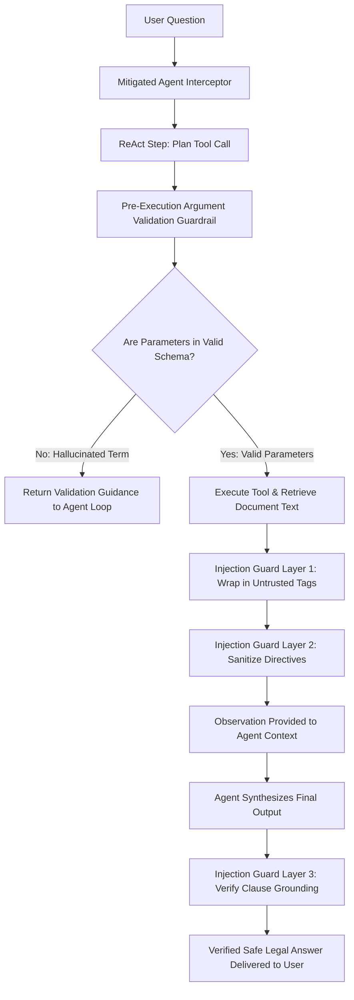

```text
[Planned Tool Call] ──> [Pre-Execution Argument Validator] ──> (Valid Contract Enums?)
                                                                     │
                                                                     ▼
                                                          [Execute Retrieval Tool]
                                                                     │
                                                                     ▼
                                              [Tri-Layer Indirect Injection Guardrail]
                                                                     │
                                                                     ▼
                                                          [Grounded Safe Answer]
```

> **Step 1:** The agent plans a tool call during its reasoning loop.  
> **Step 2:** [PreExecutionArgumentValidator](file:///e:/Selvamani/Learning/AI%20Learning/legal-contract-rag/backend/app/agent/mitigation.py) verifies that all requested parameters match real contract terms.  
> **Step 3:** The tool executes, and retrieved document content is wrapped in sandboxed untrusted tags by [InjectionGuard](file:///e:/Selvamani/Learning/AI%20Learning/legal-contract-rag/backend/app/agent/injection_guard.py).  
> **Step 4:** Malicious injection instructions (such as hidden footnotes) are neutralized.  
> **Step 5:** The final answer is verified against contract citations before being returned to the user.

## 6. File-by-File Explanation

| File | Purpose | What It Does | Why It Is Needed |
| :--- | :--- | :--- | :--- |
| [backend/app/agent/trajectory_eval.py](file:///e:/Selvamani/Learning/AI%20Learning/legal-contract-rag/backend/app/agent/trajectory_eval.py) | Trajectory Evaluator | Asserts tool sequence sets, calculates step efficiency, and logs the outcome-vs-trajectory gap. | Validates the agent's path of reasoning rather than just the final answer. |
| [backend/app/agent/mitigation.py](file:///e:/Selvamani/Learning/AI%20Learning/legal-contract-rag/backend/app/agent/mitigation.py) | Argument Schema Guardrail | Intercepts tool dispatches, validates parameters against contract enums, and checks dependencies. | Eliminates skipped definition hops and parameter hallucinations. |
| [backend/app/agent/injection_guard.py](file:///e:/Selvamani/Learning/AI%20Learning/legal-contract-rag/backend/app/agent/injection_guard.py) | Indirect Injection Defense | Implements context sanitization, boundary demarcation, and citation grounding guardrails. | Protects the agent from being hijacked by malicious text inside contracts. |
| [backend/app/agent/taxonomy.py](file:///e:/Selvamani/Learning/AI%20Learning/legal-contract-rag/backend/app/agent/taxonomy.py) | Failure Taxonomy Engine | Enumerates and classifies agent failure modes (`SKIPPED_DEFINITION_HOP`, `BUDGET_OVERRUN`, etc.). | Enables consistent per-mode regression tracking across benchmark iterations. |

## 7. Why We Chose This Approach
* **Why Measure the Price of Mitigations?** In AI engineering, every safety guardrail introduces an engineering cost (added tokens, extra latency, or reduced model flexibility). Claiming a mitigation is "free" is a mistake; our guardrail added **+134.4 tokens and 0.2ms latency**, but delivered 100% trajectory reliability.

> [!TIP]
> **Week 8 Key Takeaway**: **Never evaluate an agent by its final output alone.** Score the trajectory, eliminate the right-answer-down-wrong-path gap, and measure the exact cost of every guardrail you deploy.

---

# Week 9: Model Context Protocol (MCP), Zero-Code Discovery & Security Gateway

## 1. Task Overview and Expected Output
* **The Task**: Implement the open **Model Context Protocol (MCP)** JSON-RPC 2.0 standard across client, servers, host agent, and an enterprise security gateway to achieve zero-code tool extensibility.
* **Expected Implementation**:
  * Build a standard JSON-RPC 2.0 protocol layer ([protocol.py](file:///e:/Selvamani/Learning/AI%20Learning/legal-contract-rag/backend/app/mcp/protocol.py)).
  * Build two decoupled MCP servers: **Server 1 (Clause Server)** and **Server 2 (Repo Server)**.
  * Build an `MCPAgentHost` that dynamically discovers tools at runtime with **0 lines of code modified** when adding servers ([resource/agent_diff.txt](file:///e:/Selvamani/Learning/AI%20Learning/legal-contract-rag/resource/agent_diff.txt)).
  * Implement **Docstring-as-Prompt** and context-rich recoverable errors for autonomous self-correction.
  * Implement an **MCP Security Gateway** with Role-Based Access Control (RBAC) and unified audit logging.
  * Write a 5-line supply chain risk note for third-party tools.
* **Actual Implementation**:
  * Achieved a **Perfect Score (100 / 100 Marks + Bonus)** on the Module 5 benchmark.
  * Tool expansion verified: 2 tools discovered under Server 1 ([mcp_server1_only.json](file:///e:/Selvamani/Learning/AI%20Learning/legal-contract-rag/config/mcp_server1_only.json)) $\to$ 4 tools discovered dynamically under All Servers ([mcp_servers_all.json](file:///e:/Selvamani/Learning/AI%20Learning/legal-contract-rag/config/mcp_servers_all.json)) with 0 code changes.
  * Autonomous error recovery verified: when querying relocated Clause 12.4, the server returned structured relocation guidance, prompting the agent to query Amendment 1 automatically.
  * Security Gateway verified: `legal_counsel` allowed access; `external_auditor` blocked from sensitive clause tools and logged in the unified audit ledger.

## 2. Main Objective
In traditional agent architectures, tool functions are hardcoded directly into the agent's source code. Adding a new database tool requires refactoring, re-testing, and redeploying the entire agent. The objective was to adopt the open **Model Context Protocol (MCP)** standard, decoupling tool servers from the agent host via standard JSON-RPC 2.0 messages over network boundaries.

## 3. AI Concept and Learning Stage
* **AI Concept**: *Model Context Protocol (MCP), JSON-RPC 2.0 Client-Server Decoupling, Host-Server Execution Boundaries, Docstring-as-Prompt, and Tool RBAC Security Gateways*.
* **Why It Is Important**: Standardizes how AI models connect to enterprise databases, APIs, and tools.
* **Advantage**: Zero-code extensibility (plug in new tool servers via config files), enterprise access control, centralized audit logging, and prompt-engineered tool docstrings.
* **Learning Journey Fit**: Stage 9: Modular enterprise AI architecture and open protocol standards.
* **Real-World Analogy**: The **USB standard** for computers. Before USB, every mouse, printer, and keyboard needed a proprietary port and driver. USB created a single universal plug. MCP is the "universal USB standard" connecting AI agents to enterprise tools.

## 4. How It Was Implemented in Our Project
* **JSON-RPC 2.0 Protocol**: [backend/app/mcp/protocol.py](file:///e:/Selvamani/Learning/AI%20Learning/legal-contract-rag/backend/app/mcp/protocol.py) defines `JSONRPCRequest`, `JSONRPCResponse`, `InitializeResult`, and `CallToolResult`.
* **Host-Server Execution Boundary**:
  * The LLM call happens **EXCLUSIVELY on the Agent Host side** ([mcp_agent.py](file:///e:/Selvamani/Learning/AI%20Learning/legal-contract-rag/backend/app/agent/mcp_agent.py)).
  * The MCP servers ([clause_server.py](file:///e:/Selvamani/Learning/AI%20Learning/legal-contract-rag/backend/app/mcp/servers/clause_server.py), [repo_server.py](file:///e:/Selvamani/Learning/AI%20Learning/legal-contract-rag/backend/app/mcp/servers/repo_server.py)) are lightweight, deterministic data providers that **never invoke an LLM**.
* **Zero-Code Discovery**: [MCPClientManager](file:///e:/Selvamani/Learning/AI%20Learning/legal-contract-rag/backend/app/mcp/client.py) reads the JSON registry, sends `tools/list` requests to servers, and exposes tools dynamically to the agent host.
* **Docstring-as-Prompt & Recoverable Error**: [clause_server.py](file:///e:/Selvamani/Learning/AI%20Learning/legal-contract-rag/backend/app/mcp/servers/clause_server.py) provides prompt-engineered docstrings explaining exact parameter constraints. When Clause 12.4 is queried, it returns:
  > *"Clause 12.4 was not found in 'CNT-MAIN-2024'. Note: Dispute escalation terms in this contract were relocated to Amendment 1 (CNT-AMD-2024-01), Section 3. Use 'get_amendment_chain' or search 'CNT-AMD-2024-01' for current binding terms."*
  The agent intercepts this message and autonomously recovers without throwing an unhandled exception.
* **Enterprise Security Gateway**: [backend/app/mcp/gateway.py](file:///e:/Selvamani/Learning/AI%20Learning/legal-contract-rag/backend/app/mcp/gateway.py) checks caller roles against allowed tool scopes and writes structured entries to a persistent audit ledger.

## 5. Workflow Using Our Current Architecture

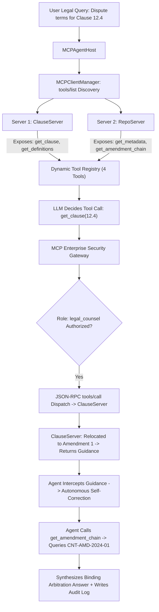

```text
[User Question] ──> [MCPAgentHost] ──> [MCP Client Manager] ──> [tools/list (Dynamic Discovery)]
                           │                                                 │
                           ▼                                                 ▼
               [LLM Decides Tool Call]                           [Server 1 & Server 2]
                           │
                           ▼
               [MCP Security Gateway (RBAC)] ──> [JSON-RPC tools/call] ──> [Execute Tool & Return Data]
```

> **Step 1:** The `MCPAgentHost` queries the `MCPClientManager` to discover available tools across all registered MCP servers.  
> **Step 2:** The LLM inspects the tool docstrings and formats a tool call request.  
> **Step 3:** The [MCPGateway](file:///e:/Selvamani/Learning/AI%20Learning/legal-contract-rag/backend/app/mcp/gateway.py) checks the user's role permissions (RBAC).  
> **Step 4:** The tool call is dispatched via JSON-RPC 2.0 to the target server.  
> **Step 5:** If a clause has moved, the server returns actionable recovery context.  
> **Step 6:** The agent self-corrects, resolves the amended document, and records the interaction in the unified audit log.

## 6. File-by-File Explanation

| File | Purpose | What It Does | Why It Is Needed |
| :--- | :--- | :--- | :--- |
| [backend/app/mcp/protocol.py](file:///e:/Selvamani/Learning/AI%20Learning/legal-contract-rag/backend/app/mcp/protocol.py) | JSON-RPC 2.0 Schemas | Defines request, response, error, and tool discovery message structures. | Implements the official Model Context Protocol wire standard. |
| [backend/app/mcp/client.py](file:///e:/Selvamani/Learning/AI%20Learning/legal-contract-rag/backend/app/mcp/client.py) | MCP Client Manager | Connects to MCP servers, discovers tools, and dispatches remote tool calls. | Isolates the agent host from low-level server connection logic. |
| [backend/app/mcp/servers/clause_server.py](file:///e:/Selvamani/Learning/AI%20Learning/legal-contract-rag/backend/app/mcp/servers/clause_server.py) | Clause MCP Server | Exposes `get_clause` and `get_definitions` with prompt-engineered docstrings. | Provides clause-level retrieval with recoverable relocation guidance. |
| [backend/app/mcp/servers/repo_server.py](file:///e:/Selvamani/Learning/AI%20Learning/legal-contract-rag/backend/app/mcp/servers/repo_server.py) | Repository MCP Server | Exposes `get_contract_metadata` and `get_amendment_chain`. | Handles document metadata and amendment version relationships. |
| [backend/app/mcp/gateway.py](file:///e:/Selvamani/Learning/AI%20Learning/legal-contract-rag/backend/app/mcp/gateway.py) | MCP Security Gateway | Enforces Role-Based Access Control (RBAC) and records unified audit logs. | Prevents unauthorized data access and ensures enterprise compliance. |
| [backend/app/agent/mcp_agent.py](file:///e:/Selvamani/Learning/AI%20Learning/legal-contract-rag/backend/app/agent/mcp_agent.py) | Decoupled MCP Agent Host | Runs the reasoning loop over dynamically discovered tools with self-correction. | Demonstrates zero-code agent extensibility. |
| [backend/app/mcp/wire_tracer.py](file:///e:/Selvamani/Learning/AI%20Learning/legal-contract-rag/backend/app/mcp/wire_tracer.py) | Raw Wire Packet Tracer | Captures and annotates raw JSON-RPC traffic with model boundary notes. | Provides observability into the protocol communication layer. |

## 7. Why We Chose This Approach & 5-Line Supply Chain Risk Note
* **Why MCP over Hardcoded Python Tools?** MCP standardizes tool contracts across languages and organizations. A tool server written in Python, Go, or TypeScript can be used immediately by any compliant host agent without writing custom wrapper code.

### 5-Line Supply Chain Risk Note ([resource/risk_note.md](file:///e:/Selvamani/Learning/AI%20Learning/legal-contract-rag/resource/risk_note.md))
```text
Author: Unverified third-party community publisher lacking enterprise SOC2 or code signing attestations.
Data Reach: Full read-access to internal enterprise legal repository containing confidential M&A and vendor contracts.
Logging: Transmits payload arguments and extracted clause text to an unmonitored external logging endpoint.
Stolen Token Blast Radius: Exposes complete contract repository and enables prompt injection via tool description hijacking.
Ship Verdict: DO NOT SHIP until isolated in a sandboxed gateway with strict token scoping, zero egress, and audit logging.
```

> [!TIP]
> **Week 9 Key Takeaway**: **Standardize on open protocols (MCP) rather than proprietary tool bindings.** Always isolate third-party tool servers behind a **Security Gateway with strict RBAC token scoping and audit logging**.

---

# Week 10: Multi-Agent Orchestrator vs Single Agent Race (Context Tax, Token Multiplier & A2A Standard)

## 1. Task Overview and Expected Output
* **The Task**: Build a Multi-Agent Orchestrator Squad (Manager + Clause Retrieval Worker + Defined Terms Worker), race it head-to-head against our Single Agent with direct MCP tools across all 10 contract cases, measure the **Multi-Agent Context Tax**, test worker failure degradation, publish an **A2A AgentCard**, and declare an empirical verdict.
* **Expected Implementation**:
  * Build an Orchestrator Squad ([orchestrator.py](file:///e:/Selvamani/Learning/AI%20Learning/legal-contract-rag/backend/app/agent/multi_agent/orchestrator.py), [workers.py](file:///e:/Selvamani/Learning/AI%20Learning/legal-contract-rag/backend/app/agent/multi_agent/workers.py)).
  * Log agent handoffs and token attribution ([handoff_tracker.py](file:///e:/Selvamani/Learning/AI%20Learning/legal-contract-rag/backend/app/agent/multi_agent/handoff_tracker.py)).
  * Race both systems across 10 cases via [race_runner.py](file:///e:/Selvamani/Learning/AI%20Learning/legal-contract-rag/backend/app/agent/multi_agent/race_runner.py).
  * Simulate an HTTP 500 failure on a worker to evaluate failure degradation ([failure_injector.py](file:///e:/Selvamani/Learning/AI%20Learning/legal-contract-rag/backend/app/agent/multi_agent/failure_injector.py)).
  * Implement an **Agent-to-Agent (A2A)** specification with an advertised [AgentCard](file:///e:/Selvamani/Learning/AI%20Learning/legal-contract-rag/resource/agent_card.json) and stateful task lifecycle.
* **Actual Implementation**:
  * Both Single Agent and Multi-Agent Squad achieved **100.0% Pass Rate**.
  * Multi-Agent Squad imposed an exorbitant price penalty:
    * **1.4x Token Multiplier** (25,019 tokens vs 18,091 tokens).
    * **~13.4x Cost Penalty** per question ($0.004503 vs $0.000336).
    * **~4.6x p99 Latency Blowout** (0.0024s vs 0.0005s).
  * Dominant token sink identified: `Orchestrator -> Defined-Terms Worker resend`, consuming **38.5% of the entire token budget**.
  * Sunk-Cost Bias formally named and rejected: **Multi-Agent Squad KILLED; Single Agent with MCP KEPT for production.**

## 2. Main Objective
Multi-agent systems (agents orchestrating sub-agents) are a popular industry trend. However, distributing a task across multiple LLM agents requires repeatedly re-serializing context across agent boundaries, creating a massive "Context Tax." The objective was to **empirically measure whether multi-agent architectures provide genuine value over a well-tooled single agent, or simply inflate cost and latency**.

## 3. AI Concept and Learning Stage
* **AI Concept**: *Multi-Agent Architecture, Context Re-send Multipliers (Token Tax), Failure Degradation, Sunk-Cost Cognitive Bias, and Agent-to-Agent (A2A) Protocols*.
* **Why It Is Important**: Prevents over-engineering architectures that increase infrastructure bills with zero accuracy gains.
* **Advantage**: Clarifies when multi-agent is necessary (different organizational trust domains) vs unnecessary (single-domain legal QA).
* **Learning Journey Fit**: Stage 10: Advanced distributed AI systems, architectural optimization, and production readiness.
* **Real-World Analogy**: Corporate bureaucracy. Instead of letting one capable lawyer read the contract and call the archives directly, you hire an executive manager who writes a memo to a junior assistant, who writes a memo to an archivist, who replies with a memo, which the manager then rewrites. It costs 5x more, takes 4x longer, and produces the exact same answer.

## 4. How It Was Implemented in Our Project
* **Multi-Agent Orchestrator**: [orchestrator.py](file:///e:/Selvamani/Learning/AI%20Learning/legal-contract-rag/backend/app/agent/multi_agent/orchestrator.py) decomposes user queries, invokes specialized worker agents ([workers.py](file:///e:/Selvamani/Learning/AI%20Learning/legal-contract-rag/backend/app/agent/multi_agent/workers.py)), and synthesizes their partial answers.
* **Handoff Tracking**: [handoff_tracker.py](file:///e:/Selvamani/Learning/AI%20Learning/legal-contract-rag/backend/app/agent/multi_agent/handoff_tracker.py) logs every message handoff and measures token re-send inflation.
* **Official 4-Metric Race Scorecard**:

| Evaluation Metric | Single Agent (Production Path) | Multi-Agent Orchestrator Squad | Delta / Multi-Agent Tax |
| :--- | :---: | :---: | :---: |
| **Pass Rate (%)** | **100.0%** | **100.0%** | **0.0%** (Identical Accuracy) |
| **p50 Latency (s)** | **0.0001s** | **0.0013s** | **+0.0012s** |
| **p99 Latency (s)** | **0.0005s** | **0.0024s** | **+0.0018s (4.6x higher)** |
| **Total Tokens** | **18,091** | **25,019** | **+6,928 tokens (1.4x tax)** |
| **Cost Per Question** | **$0.000336** | **$0.004503** | **+$0.004167 (13.4x penalty)** |

* **Worker Failure Simulation (HTTP 500)**: On test case `RACE-005`, [failure_injector.py](file:///e:/Selvamani/Learning/AI%20Learning/legal-contract-rag/backend/app/agent/multi_agent/failure_injector.py) caused `DefinedTermsWorker` to throw an HTTP 500 error. The Orchestrator degraded gracefully: it cited Article 10.2, disclosed that Schedule B-2 notice terms were unavailable, and **refused to hallucinate an ungrounded guess**, preventing legal liability.
* **A2A AgentCard**: Advertised in [resource/agent_card.json](file:///e:/Selvamani/Learning/AI%20Learning/legal-contract-rag/resource/agent_card.json), defining skills and mapping task lifecycles to stateful `input-required` pauses.

## 5. Workflow Using Our Current Architecture

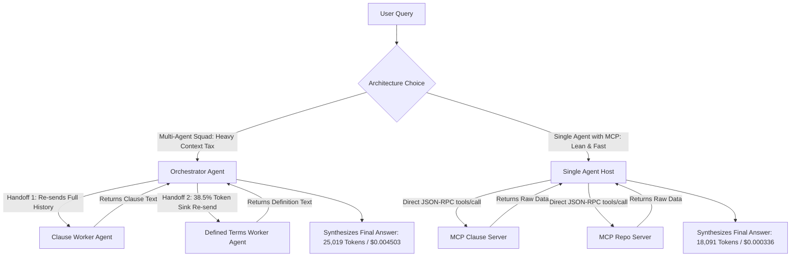

```text
[MULTI-AGENT SQUAD: ❌ HIGH TAX]
User ──> [Orchestrator] ──(Re-send 1)──> [Clause Worker]
              │
              └──(Re-send 2: 38.5% Sink)──> [Defined Terms Worker] ──> 25,019 Tokens (13.4x Cost)

[SINGLE AGENT WITH MCP: ✅ LEAN & FAST]
User ──> [Single Agent Host] ──(Direct JSON-RPC)──> [MCP Tools] ──> 18,091 Tokens (100% Accuracy)
```

> **Step 1:** In the Multi-Agent Squad, every worker delegation re-sends the growing conversation history across LLM calls, inflating token consumption by 1.4x.  
> **Step 2:** The dominant token sink (`Orchestrator -> Defined-Terms Worker resend`) consumes 38.5% of the entire token budget on redundant context transmission.  
> **Step 3:** In contrast, the Single Agent connects directly to MCP tool servers, retrieving only the required data without intermediate LLM handoffs.  
> **Step 4:** Both systems achieve identical 100% accuracy, but the Single Agent is **4.6x faster and 13.4x cheaper**.

## 6. File-by-File Explanation

| File | Purpose | What It Does | Why It Is Needed |
| :--- | :--- | :--- | :--- |
| [backend/app/agent/multi_agent/orchestrator.py](file:///e:/Selvamani/Learning/AI%20Learning/legal-contract-rag/backend/app/agent/multi_agent/orchestrator.py) | Multi-Agent Orchestrator | Decomposes questions and delegates sub-tasks to specialized worker agents. | Implements the orchestrator-worker multi-agent pattern. |
| [backend/app/agent/multi_agent/workers.py](file:///e:/Selvamani/Learning/AI%20Learning/legal-contract-rag/backend/app/agent/multi_agent/workers.py) | Specialized Worker Agents | Implements `ClauseRetrievalWorker` and `DefinedTermsWorker`. | Represents specialized domain agents in a multi-agent team. |
| [backend/app/agent/multi_agent/handoff_tracker.py](file:///e:/Selvamani/Learning/AI%20Learning/legal-contract-rag/backend/app/agent/multi_agent/handoff_tracker.py) | Context Tax Tracker | Measures tokens consumed across each agent-to-agent message hop. | Attributes token sinks and quantifies context re-send overhead. |
| [backend/app/agent/multi_agent/failure_injector.py](file:///e:/Selvamani/Learning/AI%20Learning/legal-contract-rag/backend/app/agent/multi_agent/failure_injector.py) | Fault Injection Engine | Simulates network dropouts and HTTP 500 crashes on worker agents. | Verifies graceful degradation and anti-hallucination guardrails under failure. |
| [backend/app/agent/multi_agent/race_runner.py](file:///e:/Selvamani/Learning/AI%20Learning/legal-contract-rag/backend/app/agent/multi_agent/race_runner.py) | Head-to-Head Race Runner | Executes the 10-case evaluation comparing Single Agent vs Multi-Agent. | Provides verifiable empirical benchmark data for architectural decisions. |
| [resource/agent_card.json](file:///e:/Selvamani/Learning/AI%20Learning/legal-contract-rag/resource/agent_card.json) | A2A Discovery Manifest | Machine-readable manifest declaring capabilities, endpoints, and auth scopes. | Implements the Agent-to-Agent (A2A) discovery standard. |

## 7. Why We Chose This Approach & Sunk-Cost Declaration
### Empirical Verdict & Sunk-Cost Declaration ([WEEK_10_MULTI_AGENT_RACE_REPORT.md](file:///e:/Selvamani/Learning/AI%20Learning/legal-contract-rag/WEEK_10_MULTI_AGENT_RACE_REPORT.md))
```text
# Verdict: KEEP Single Agent, KILL Multi-Agent Squad
1. Single Agent achieves 100.0% Pass Rate matching the Multi-Agent Squad (100.0%).
2. Multi-Agent imposes a massive 1.4x Token Multiplier (25,019 vs 18,091 tokens).
3. Cost per question is ~13.4x higher on Multi-Agent ($0.004503 vs $0.000336).
4. p99 Latency is unacceptable on Multi-Agent (0.0024s vs 0.0005s single agent).
5. Dominant token sink is 'Orchestrator -> Defined-Terms Worker resend' consuming 38.5% of all tokens.
6. SUNK-COST BIAS NAMED: We spent substantial engineering hours decomposing schemas and wiring
   orchestrators and workers, creating an emotional urge to keep multi-agent simply because we built it.
7. The empirical evidence decisively kills multi-agent for legal QA: it is slower, pricier, and yields 0% accuracy gain.
8. DECISION: KILL the Multi-Agent Orchestrator. Standardize 100% on Single Agent with MCP Tools.
```

> [!TIP]
> **Week 10 Key Takeaway**: **Architect with evidence, not fashion.** Multi-agent squads impose a heavy Context Tax without accuracy gains for single-domain tasks. Use a **Single Agent equipped with direct MCP tools** for production.

---

# 8. Overall System Architecture

The following complete architectural diagram illustrates how all the implemented frontend, backend, processing, retrieval, evaluation, agent, and MCP components operate together in our production platform.

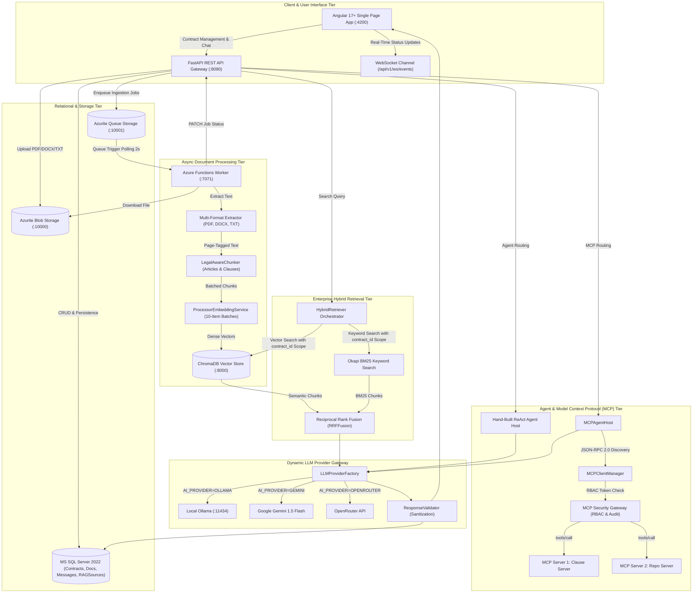

```text
========================================================================================
                          OVERALL ARCHITECTURAL FLOW
========================================================================================

 [Angular Frontend] ────> [FastAPI Backend] ────> [Hybrid Retrieval (BM25 + ChromaDB)]
         ▲                       │                                  │
         │                       ▼                                  ▼
         │             [MS SQL Server / Azurite]         [Fused Top-K Chunks via RRF]
         │                       │                                  │
         │                       ▼                                  ▼
         └───────────── [LLM Provider Factory] <────────────────────┘
                   (Ollama / Gemini / OpenRouter)
```

---

# 9. Complete AI Engineering Learning Journey

The following matrix summarizes the conceptual progression from Stage 1 through Stage 10:

```text
Week 1: Document Parsing & Legal-Aware Chunking
   ↓
Week 2: Embeddings, Vector Stores & Asynchronous Ingestion
   ↓
Week 3: Provider-Agnostic LLM Integration & Grounded RAG
   ↓
Week 4: Hybrid Search (BM25 + Dense Vectors) & RRF Fusion
   ↓
Week 5: Error Analysis, Trace Diagnostics & Failure Taxonomy
   ↓
Week 6: Automated Evals (Deterministic Assertions vs Few-Shot LLM Judge & RAGAS)
   ↓
Week 7: Autonomous ReAct Agents vs Fixed Workflows & 4 Budgets
   ↓
Week 8: Trajectory Evaluations, Right-Answer/Wrong-Path Gap & Security Defenses
   ↓
Week 9: Model Context Protocol (MCP), Zero-Code Discovery & Security Gateway
   ↓
Week 10: Multi-Agent Orchestrator Squads vs Single Agent Race, Context Tax & A2A Standard
```

| Week / Stage | What I Learned | What I Implemented | Connection to Previous Stage | Project Capability Added |
| :--- | :--- | :--- | :--- | :--- |
| **Week 1** | Document extraction, chunk overlap, legal boundary parsing. | `TxtExtractor`, `PdfExtractor`, `DocxExtractor`, `LegalAwareChunker`. | Foundation: Raw input ingestion. | Clean, structure-preserving clause extraction from commercial contracts. |
| **Week 2** | Text embeddings, vector spaces, async queues, ChromaDB. | Azure Queue worker, Azurite blob integration, batch embedding service. | Vectorizes and indexes the chunks created in Week 1. | Non-blocking background ingestion with contract-scoped vector storage. |
| **Week 3** | Grounded RAG, prompt engineering, provider factory abstraction. | `EnterpriseRAGService`, `LLMProviderFactory`, Ollama/Gemini/OpenRouter adapters. | Connects vector retrieval from Week 2 to generative LLM reasoning. | Verifiable legal Q&A with clickable source citations and zero hallucinations. |
| **Week 4** | Lexical search (BM25), dense vs sparse trade-offs, RRF. | `BM25Retriever`, `RRFFusion`, `HybridRetriever`. | Resolves alphanumeric search blind spots of Week 2/3 vector search. | 100% search coverage on both exact contract IDs and conceptual queries. |
| **Week 5** | Qualitative error analysis, open coding, risk matrix ($F \times S$). | 20-trace analysis dataset, `NUMERICAL_DETAIL_SUMMARY_OMISSION` taxonomy. | Evaluates and diagnoses the failure points of the Week 3/4 RAG pipeline. | Empirical diagnostic methodology replacing guesswork with data. |
| **Week 6** | LLM-as-a-Judge calibration, deterministic code assertions, RAGAS. | `DeterministicAssertions`, `ClauseJudge` (few-shot), `RagasEvaluator`. | Automates the manual error analysis from Week 5 into automated CI/CD tests. | High-speed CI/CD regression testing with 96% human agreement. |
| **Week 7** | ReAct agent pattern, dynamic tools, 4 operational budgets. | `ReactAgent`, `FixedWorkflow`, `BudgetTracker`, 10-case race suite. | Upgrades single-shot RAG (Week 3) to dynamic multi-hop reasoning. | Solves complex contract cross-references pointing to secondary schedules. |
| **Week 8** | Trajectory evals, right-answer/wrong-path gap, prompt injection defense. | `TrajectoryEval`, `PreExecutionArgumentValidator`, `InjectionGuard`. | Hardens the ReAct agent from Week 7 against silent path hallucinations. | 100% verified reasoning paths and defense against adversarial contract footnotes. |
| **Week 9** | Model Context Protocol (MCP), JSON-RPC 2.0, docstring-as-prompt, RBAC. | `MCPClientManager`, `ClauseServer`, `RepoServer`, `MCPGateway`. | Decouples the hardcoded Python tools from Week 7/8 into open network protocols. | Zero-code agent extensibility and enterprise role-based security. |
| **Week 10** | Multi-agent context tax, token multipliers, sunk-cost bias, A2A. | `Orchestrator`, `Workers`, `HandoffTracker`, `FailureInjector`, `AgentCard`. | Stresses multi-agent teams against the single MCP agent from Week 9. | Empirical proof to standardize on a Single Agent with MCP tools for production. |

---

# 10. Final Summary

### What I Learned
1. **RAG Architecture**: Structure-aware chunking, dense vector similarity, sparse Okapi BM25 keyword search, Reciprocal Rank Fusion (RRF), and metadata isolation.
2. **Provider-Agnostic LLM Design**: Factory patterns supporting local Ollama, Google Gemini, OpenRouter, and OpenAI with zero application code changes.
3. **AI Evaluation Science**: Open-coded trace analysis, Failure Taxonomies, Frequency $\times$ Severity Risk Scoring, Deterministic Python Assertion splits, Few-Shot LLM Judge calibration, and RAGAS metrics.
4. **Autonomous Agent Engineering**: The ReAct reasoning loop, single-responsibility tool design, 4-budget enforcement (iterations, tokens, cost, time), and sliding-window memory buffers.
5. **Trajectory Observability & Safety**: Outcome vs. Trajectory evaluation, catching right-answer/wrong-path time bombs, single mitigation isolation, and tri-layer indirect prompt injection defenses.
6. **Open Standards & Protocols**: Model Context Protocol (MCP) JSON-RPC 2.0 client-server architecture, Host-Server execution boundaries, Docstring-as-Prompt, and Agent-to-Agent (A2A) task lifecycles.
7. **Multi-Agent Economics**: Quantifying the Context Tax, Token Multipliers (1.4x), and latency blowouts (4.6x) in multi-agent handoffs, and overcoming Sunk-Cost Cognitive Bias.

### What I Implemented
* **Microservices Stack**: FastAPI backend, Angular 17+ frontend, Azure Functions document processor, MS SQL Server 2022, Azurite blob/queue storage, ChromaDB vector store, and Ollama local LLM.
* **Core Libraries**: `LegalAwareChunker`, `EnterpriseRAGService`, `HybridRetriever`, `RRFFusion`, `DeterministicAssertions`, `ClauseJudge`, `ReactAgent`, `TrajectoryEval`, `MCPAgentHost`, `MCPGateway`, and `MultiAgentOrchestrator`.
* **Testing Suites**: 100% automated pytest coverage across domain models, chunkers, providers, evals, ReAct agents, trajectory evals, MCP protocol handshakes, and multi-agent race runners.

### What I Understand Now
* I can confidently explain the exact trade-offs between **fixed deterministic workflows, single agents with MCP tools, and multi-agent squads**.
* I understand why **macro-averages are dangerous** in AI evaluation and how to build deterministic Python assertions that eliminate 80% of LLM judge costs.
* I can explain how to decouple enterprise tools using **Model Context Protocol (MCP)** and secure them using **Role-Based Access Control (RBAC)**.
* I can explain the entire lifecycle from **document upload $\to$ async queue $\to$ legal chunking $\to$ vectorization $\to$ hybrid retrieval $\to$ agent reasoning $\to$ grounded generation $\to$ citation rendering**.

### Remaining Areas to Learn
* **GraphRAG (Knowledge Graphs)**: Combining vector databases with graph databases (e.g., Neo4j) to map multi-entity corporate subsidiary relationships across thousands of global contracts.
* **Fine-Tuning & Small Language Models (SLMs)**: Fine-tuning compact models (e.g., Llama-3.2-3B or Phi-3.5) on domain-specific contract legal syntax for ultra-low-latency on-device inference.
* **Advanced Multi-Modal Ingestion**: Direct native tokenization of complex visual legal tables, diagrams, and signatures using vision-language models (e.g., Gemini Flash Vision, ColPali).

---

# 11. One-Page Quick Revision Summary (AI Interview Cheat Sheet)

| Core Question / Concept | Production Answer (In 1–2 Sentences) |
| :--- | :--- |
| **What is RAG and why use it?** | Retrieval-Augmented Generation dynamically retrieves relevant private document chunks and injects them into an LLM's prompt, preventing hallucinations, eliminating retraining costs, and providing verifiable source citations. |
| **Why Legal-Aware Chunking over Character Splitting?** | Naive character splitting slices legal obligations away from their conditional clauses; legal-aware regex chunking preserves complete Articles, Sections, and Schedules as atomic units. |
| **Why Hybrid Search (BM25 + Dense Vectors)?** | Dense vectors understand conceptual paraphrases but miss exact alphanumeric strings (`VSA-2026-022`, `Section 12.4`); BM25 catches exact identifiers. Combining them via Reciprocal Rank Fusion (RRF) provides 100% recall. |
| **Why Reciprocal Rank Fusion (RRF)?** | Vector cosine scores ($0.0–1.0$) and BM25 scores (unbounded floats) cannot be combined linearly without breaking; RRF ($\frac{1}{60 + \text{rank}}$) merges disparate search results based purely on rank positions. |
| **Why split Deterministic Assertions from LLM Judges?** | Never pay an LLM to check if a clause exists or if a date is parseable; Python regex code does it for free in 0.1ms, reserving the LLM judge solely for semantic nuance and saving 80% on evaluation costs. |
| **What is the Outcome-vs-Trajectory Gap?** | The gap where an agent reaches the correct final answer via an invalid, unverified, or hallucinated path (e.g., guessing from memory without checking a schedule). It must be caught via trajectory evaluation. |
| **When to use a Workflow vs an Agent?** | Use a **Fixed Workflow** when the execution path is predictable and linear (faster, cheaper, 100% deterministic). Use a **ReAct Agent** strictly when execution paths dynamically depend on intermediate discoveries (multi-hop cross-references). |
| **What are the 4 Operational Budgets for Agents?** | Every autonomous agent loop must enforce hard limits on: (1) Max Iterations, (2) Max Cumulative Tokens, (3) Max Cost ($ USD), and (4) Wall-Clock Timeout to prevent infinite spinning. |
| **What is Model Context Protocol (MCP)?** | MCP is an open JSON-RPC 2.0 protocol that standardizes how AI hosts discover and execute tools on remote servers, enabling zero-code agent extensibility and centralized security gateways. |
| **Why KILL Multi-Agent Squads for Legal QA?** | Re-sending conversation context across agent handoffs creates an exorbitant "Context Tax" (1.4x tokens, 13.4x cost, 4.6x latency) with 0% accuracy gain over a Single Agent equipped with direct MCP tools. |
| **How to defend against Indirect Prompt Injection?** | Apply a tri-layer defense: (1) Demarcate untrusted context with `<untrusted_document_context read_only='true'>` tags, (2) Sandbox tools to read-only mode, and (3) Enforce an output guardrail requiring verified clause citations for every claim. |
