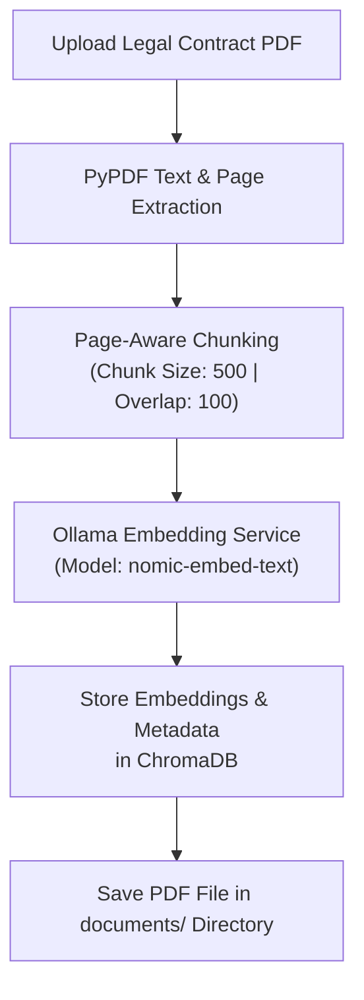
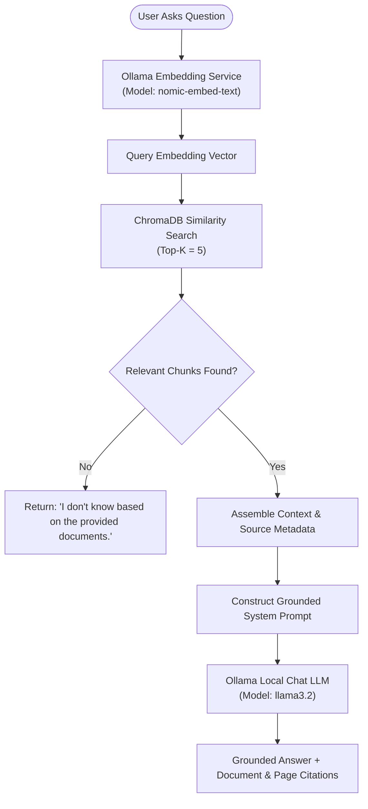

# 📄 Legal Contract Assistant (100% Local RAG)

A privacy-focused, fully local Retrieval-Augmented Generation (RAG) web application designed for processing, indexing, and querying legal contract PDF documents. The application runs **100% locally and offline** using [Ollama](https://ollama.com) for both text generation and vector embeddings, powered by [ChromaDB](https://www.trychroma.com/) for local vector persistence and [FastAPI](https://fastapi.tiangolo.com/) for backend service delivery.

---

## 🌟 Key Features

- **🔒 100% Local & Private**: Zero external API dependencies (no OpenAI or cloud keys required). All sensitive contract data remains strictly on your local machine.
- **📄 Document Parsing with Page Awareness**: Extracts text from PDF files using `pypdf`, preserving exact document names, page numbers, and chunk indices for auditability.
- **⚡ Batch Embedding Optimization**: Vectorizes text chunks using Ollama's `nomic-embed-text` model in configurable batch sizes to prevent timeouts on large legal documents.
- **🎯 Anti-Hallucination & Grounded Responses**: Utilizes strict system prompts to constrain answers exclusively to retrieved contract context. Returns *"I don't know based on the provided documents."* if information is absent.
- **📍 Detailed Source Citations**: Answers automatically cite the source document name, page number, and chunk index.
- **🖥️ All-in-One FastAPI Server**: Serves both REST API endpoints and the clean, responsive web frontend on a single port (`http://localhost:8000`).

---

## 🏗️ System Architecture & Workflow

### 1. Document Ingestion & Vectorization Flow



```text
[PDF Upload] ──► [PyPDF Text Extraction] ──► [Page-Aware Chunking]
                                                    │
                                                    ▼
[ChromaDB Vector Store] ◄── [Embeddings] ◄── [Ollama: nomic-embed-text]
```

### 2. Retrieval-Augmented Generation (RAG) Query Flow



```text
User Question ──► Ollama (nomic-embed-text) ──► Query Vector
                                                      │
                                                      ▼
Grounded Answer ◄── Ollama (llama3.2) ◄── ChromaDB Similarity Search
+ Source Citations       Local LLM             (Top-5 Context Chunks)
```

---

## 🛠️ Technology Stack

| Component | Technology | Purpose |
| :--- | :--- | :--- |
| **Backend Framework** | [FastAPI](https://fastapi.tiangolo.com/) | High-performance asynchronous Python web framework |
| **ASGI Server** | [Uvicorn](https://www.uvicorn.org/) | Lightning-fast ASGI server |
| **LLM Engine** | [Ollama](https://ollama.com/) (`llama3.2`) | Local LLM for answer generation |
| **Embedding Engine** | [Ollama](https://ollama.com/) (`nomic-embed-text`) | Local vector embedding model (768 dimensions) |
| **Vector Database** | [ChromaDB](https://www.trychroma.com/) | Persistent local vector store (`./chroma_data`) |
| **PDF Processing** | [PyPDF](https://pypdf.readthedocs.io/) | PDF text extraction and page parsing |
| **HTTP Client** | [httpx](https://www.python-httpx.org/) | Async HTTP client for communicating with Ollama APIs |
| **Frontend UI** | Vanilla HTML5 / CSS3 / JavaScript | Modern interactive interface served directly via FastAPI |

---

## 🚀 Quick Start & Setup Guide

### 1. Prerequisites

- **Python 3.11+** installed on your system.
- **Ollama** installed from [ollama.com/download](https://ollama.com/download).

### 2. Pull Required Ollama Models

Open a terminal and download the local LLM and embedding models:

```bash
# Pull the LLM for chat & answer generation
ollama pull llama3.2

# Pull the embedding model for text vectorization
ollama pull nomic-embed-text
```

Verify models are installed:
```bash
ollama list
```

### 3. Setup Virtual Environment & Install Dependencies

Clone or open the project directory and set up a Python virtual environment:

#### Windows (PowerShell):
```powershell
python -m venv .venv
.\.venv\Scripts\Activate.ps1
pip install -r requirements.txt
```

#### macOS / Linux:
```bash
python3 -m venv .venv
source .venv/bin/activate
pip install -r requirements.txt
```

### 4. Environment Configuration

Copy or create a `.env` file in the root project folder:

```ini
# ─── Ollama LLM Settings ──────────────────────────────────────
OLLAMA_BASE_URL=http://localhost:11434
OLLAMA_MODEL=llama3.2
OLLAMA_TIMEOUT=120

# ─── Ollama Embedding Model ───────────────────────────────────
OLLAMA_EMBEDDING_MODEL=nomic-embed-text
OLLAMA_EMBEDDING_BATCH_SIZE=10
OLLAMA_EMBEDDING_TIMEOUT=120

# ─── ChromaDB Settings ────────────────────────────────────────
CHROMA_PERSIST_DIRECTORY=./chroma_data
COLLECTION_NAME=legal_contracts

# ─── RAG Chunking Parameters ──────────────────────────────────
CHUNK_SIZE=500
CHUNK_OVERLAP=100
TOP_K=5
```

### 5. Start the Application

Start the FastAPI application with Uvicorn:

```bash
uvicorn app.main:app --reload
```

### 6. Access the Application

Open your browser and navigate to:
👉 **[http://localhost:8000](http://localhost:8000)**

*(Swagger API Documentation is available at `http://localhost:8000/docs`)*

---

## 🔍 How It Works (In Detail)

### 1. PDF Upload & Document Parsing
- When a contract PDF is uploaded via `/api/documents/upload`, `PDFService` extracts page-by-page text using `pypdf`.
- The document is saved to the `documents/` folder with a unique UUID prefix.

### 2. Text Chunking
- `ChunkingService` processes page text into overlapping chunks (default: 500 characters with 100 character overlap).
- Each chunk preserves metadata: `document_name`, `page` number, and `chunk_index`.

### 3. Vector Embedding & Storage
- `EmbeddingService` sends batch requests (`/api/embed`) to the local Ollama instance using `nomic-embed-text`.
- The resulting 768-dimensional embeddings along with text chunks and metadata are persisted in local ChromaDB storage (`./chroma_data`).

### 4. Semantic Search & Grounded Answering
- When a user asks a question via `/api/chat/`, `RAGService`:
  1. Embeds the user question using `nomic-embed-text`.
  2. Queries ChromaDB for the Top-K (default: 5) most relevant context chunks.
  3. Formulates a strict system prompt instructing `llama3.2` to rely **only** on retrieved context.
  4. Returns the generated answer along with exact document name and page citations.

---

## 📡 API Reference

| Endpoint | Method | Description |
| :--- | :--- | :--- |
| `GET /health` | `GET` | Health check endpoint returning status of FastAPI backend and local Ollama instance |
| `POST /api/documents/upload` | `POST` | Upload and index a legal contract PDF document |
| `GET /api/documents/` | `GET` | List all indexed documents, chunk totals, and metadata |
| `DELETE /api/documents/{doc_id}` | `DELETE` | Remove an indexed document from ChromaDB and filesystem |
| `POST /api/chat/` | `POST` | Query the RAG system with a question |

---

## 🔬 Chunk Size & Parameter Tuning

We evaluated multiple chunking configurations for dense legal contracts:

| Configuration | Chunk Size | Overlap | Performance & Retrieval Characteristics |
| :--- | :---: | :---: | :--- |
| **Small Chunks** | 300 | 50 | Highly precise, but risks splitting complex legal clauses across chunk boundaries. |
| **Recommended** | **500** | **100** | **Optimal balance**: Captures full legal clauses and definitions while maintaining low noise. |
| **Large Chunks** | 800 | 150 | High context retention, but increases noise and context length for LLM processing. |

---

## ❓ Troubleshooting & FAQs

### 1. `404 Not Found` for `http://localhost:11434/api/embed`
- **Cause**: The embedding model `nomic-embed-text` has not been pulled into Ollama yet.
- **Fix**: Run `ollama pull nomic-embed-text` in your terminal.

### 2. `Cannot connect to Ollama at http://localhost:11434`
- **Cause**: Ollama service is not running.
- **Fix**: Start Ollama by running `ollama serve` or launching the Ollama desktop application.

### 3. Embedding Timeouts on Large Contracts
- **Fix**: Reduce `OLLAMA_EMBEDDING_BATCH_SIZE` (e.g. set to `5` in `.env`) or decrease `CHUNK_SIZE`.

---

## 📁 Project Structure

```
legal-contract-rag/
├── app/
│   ├── api/
│   │   ├── chat.py           # Chat API endpoint router
│   │   └── documents.py      # Document upload & listing endpoints
│   ├── models/
│   │   └── schemas.py        # Pydantic request/response schemas
│   ├── services/
│   │   ├── chroma_service.py # Vector database operations
│   │   ├── chunking_service.py# Document chunking logic
│   │   ├── embedding_service.py# Ollama batch embedding client
│   │   ├── ollama_service.py # Ollama LLM chat client
│   │   ├── pdf_service.py    # PyPDF text extraction
│   │   └── rag_service.py    # RAG pipeline orchestration
│   ├── config.py             # Application configuration
│   └── main.py               # FastAPI entry point & static file serving
├── frontend/
│   ├── index.html            # Web UI main HTML
│   ├── styles.css            # Custom CSS styling
│   └── app.js                # Frontend API client & UI logic
├── chroma_data/              # Local ChromaDB persistent database
├── documents/                # Saved contract PDF files
├── .env                      # Environment variable configuration
├── requirements.txt          # Python dependencies
└── README.md                 # Project documentation
```
