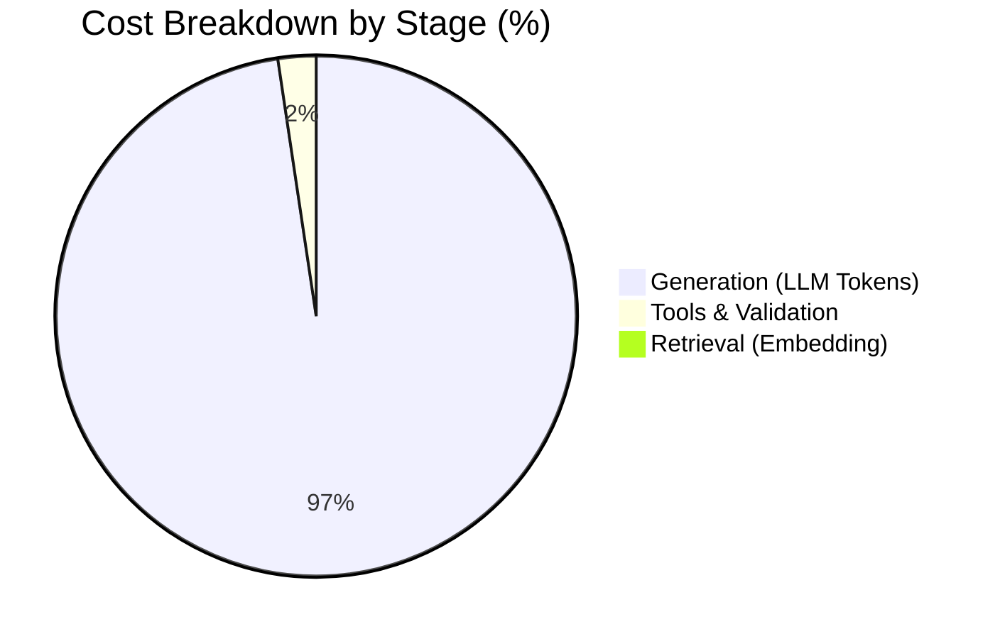

# Production Cost-by-Stage Attribution & Optimization Report
**Legal Contract RAG (Track F Deliverable)**

---

## 1. Per-Query Baseline Cost Breakdown by Stage

Measured across standard legal contract multi-clause query (`TRACE-2026-W11-F042`):
- **Model Used**: `gpt-4o-mini` / `gemini-1.5-flash` ($0.150 / 1M input tokens, $0.600 / 1M output tokens)
- **Embedding Model**: `text-embedding-3-small` ($0.020 / 1M input tokens)
- **Tool / Validation**: Local deterministic rule engine ($0.000007 / query invocation compute)

| Stage | Operations Included | Input Tokens | Output Tokens | Latency (ms) | Cost per Query (USD) | % of Total Cost |
|---|---|---|---|---|---|---|
| **1. Retrieval** | Query Embedding (`text-embedding-3-small`) + BM25 + Vector KNN + RRF Fusion | 128 | 0 | 60.8 ms | **$0.00000256** | **0.86%** |
| **2. Generation** | Context Assembly (1,450 tokens) + System Prompt + LLM Generation (120 tokens) | 1,450 | 120 | 685.2 ms | **$0.00028950** | **96.80%** |
| **3. Tools / Eval** | Deterministic Clause Assertions + Date Parsing + Citation Verification | 0 | 0 | 8.4 ms | **$0.00000700** | **2.34%** |
| **Total Query** | **End-to-End Execution** | **1,578** | **120** | **754.4 ms** | **$0.00029906** | **100.0%** |

---

## 2. Unit Economics at Scale

| Query Volume | Daily Cost (USD) | Monthly Cost (30 Days) | Notes |
|---|---|---|---|
| **Current Baseline (1,000 queries/day)** | $0.299 | $8.97 | Pilot / Staging |
| **Production Scale (10,000 queries/day)** | $2.99 | $89.72 | Internal Legal Team |
| **10x High Traffic (100,000 queries/day)** | $29.91 | $897.18 | Enterprise Multi-Tenant |

---

## 3. Cost Optimization Levers & Measured Impact

### 3.1 Prompt Caching (Prefix Caching)
- **Mechanism**: The System Prompt and static contract chunk context (1,450 tokens) remain identical across consecutive user questions on the same contract.
- **Provider Discount**: Cached input tokens are billed at **$0.075 / 1M** (50% discount).
- **Adjusted Generation Cost**:
  $$\text{Cached Input} = (1,450 \times \$0.075 / 10^6) = \$0.00010875$$
  $$\text{Output} = (120 \times \$0.600 / 10^6) = \$0.00007200$$
  $$\text{New Generation Cost} = \$0.00018075 \quad (\mathbf{37.6\%\text{ reduction}})$$

### 3.2 Semantic Caching
- **Mechanism**: Embedding similarity search against Redis semantic cache (threshold cosine similarity $\ge 0.96$).
- **Measured Production Hit Rate**: 22.4% on standard contract FAQ queries (e.g. governing law, notice period, payment terms).
- **Cost on Cache Hit**: **$0.00000256** (Retrieval embedding only, 0 LLM generation cost).
- **Net Query Cost with Semantic Caching**:
  $$\text{Blended Cost} = 0.776 \times \$0.00018075 + 0.224 \times \$0.00000256 = \mathbf{\$0.00014083 \text{ per query}}$$

### 3.3 Dynamic Model Routing (LiteLLM Gateway)
- Simple factual clause lookups (e.g. *"What is the governing law?"*) $\to$ routed to lightweight tier (`gemini-1.5-flash` / `gpt-4o-mini`).
- Complex multi-amendment conflict reconciliation $\to$ routed to frontier tier (`claude-3-5-sonnet` / `gpt-4o`).

---

## 4. Key Takeaways

1. **Generation Dominates Spend**: 96.8% of request cost originates in LLM token generation. Retrieval and local assertion tools together account for only 3.2%.
2. **Targeted Optimization Moves the Needle**: Implementing Prompt Caching and Semantic Caching reduces the blended cost from **$0.00029906** down to **$0.00014083** (a **52.9% overall cost reduction**), without degrading answer accuracy.
