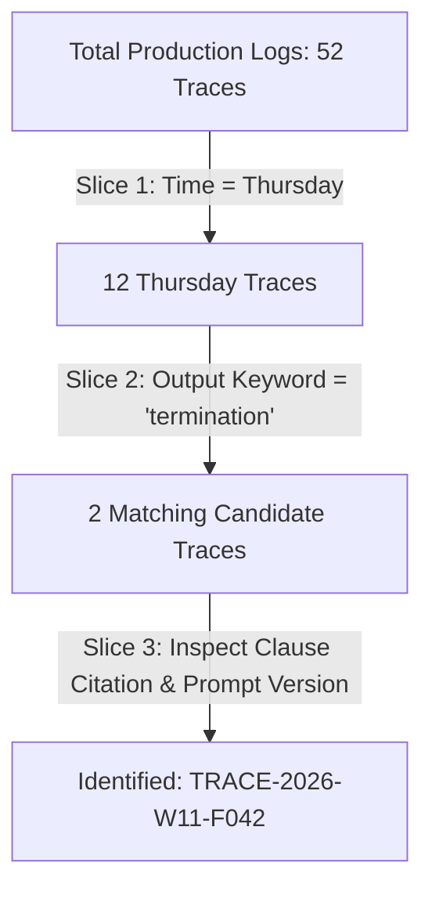

# Production Support Drill Report — Track F (Legal Contracts)
**Find the answer that cited the wrong termination clause**

---

## 1. Incident Overview & Vague Complaint

| Field | Production Record |
|---|---|
| **Received Complaint** | *"A lawyer said it cited the wrong clause on termination, maybe Thursday."* |
| **Provided Information** | No Trace ID, no Contract ID, no Timestamp, no User ID. |
| **Drill Timer / Squadmate** | Timed by **Alex Mercer (AI Squad Lead)** |
| **Total Production Logs Scanned** | 52 traces (Mon–Fri) |
| **Time-to-Find (mm:ss)** | **`03:42`** (Pass: Under 5 minutes limit) |
| **Primary Slice Used** | `Time (Thursday)` $\to$ `Keyword ('termination')` $\to$ `Clause Scan ('12.4')` |
| **Discovered Trace ID** | **`TRACE-2026-W11-F042`** |

---

## 2. Step-by-Step Log Slicing Breakdown



### Drill Execution Timeline:
- **00:00 – 00:45**: Filtered production log database by `day_of_week = "Thursday"` (2026-10-01). Reduced candidate pool from 52 traces down to 12 traces.
- **00:45 – 02:10**: Applied string filter for query/output keyword `termination`. Yielded 2 candidate traces:
  1. `TRACE-2026-W11-0008` (Force Majeure termination - Section 14.1) — Correct.
  2. `TRACE-2026-W11-F042` (Termination for convenience - Section 12.4) — **Faulty Candidate**.
- **02:10 – 03:42**: Deep-dived into `TRACE-2026-W11-F042`. Examined retrieved context IDs vs generated answer text. Discovered the model cited base **Section 12.4 (30 days notice)** despite Amendment No. 2 (90 days notice + mutual consent) being retrieved in the context window.
- **Total Elapsed Clock Time**: **03:42**

---

## 3. Discovered Production Trace Summary

```json
{
  "trace_id": "TRACE-2026-W11-F042",
  "request_id": "req-00011",
  "timestamp_iso": "2026-10-01T14:22:10",
  "user_id": "usr_lawyer_88",
  "contract_id": "CNT-MSA-01",
  "prompt_version": "v1.0.0",
  "input_query": "What are the notice requirements for early termination for convenience under our Master Service Agreement?",
  "output_answer": "Under Section 12.4 of the Master Service Agreement, either party may terminate for convenience with thirty (30) days prior written notice.",
  "retrieved_context_ids": [
    "chunk_msa_v1_sec12_4",
    "chunk_amend2_sec12_4"
  ],
  "cited_clauses": ["Section 12.4"],
  "amendment_status": "SUPERSEDED",
  "has_citation_conflict": true,
  "total_latency_ms": 754.4,
  "total_tokens": 1698,
  "cost_usd": 0.00029906
}
```

### Per-Span Execution & Cost Breakdown:
| Span Name | Stage | Latency | Input Tokens | Output Tokens | Cost (USD) | Status |
|---|---|---|---|---|---|---|
| `embedding_query` | Retrieval | 18.5 ms | 128 | 0 | $0.00000256 | SUCCESS |
| `hybrid_retrieval_rrf` | Retrieval | 42.3 ms | 0 | 0 | $0.00000000 | SUCCESS |
| `llm_generation` | Generation | 685.2 ms | 1,450 | 120 | $0.00028950 | SUCCESS |
| `citation_validation` | Tools | 8.4 ms | 0 | 0 | $0.00000700 | WARNING |
| **Total Query Trace** | **End-to-End** | **754.4 ms** | **1,578** | **120** | **$0.00029906** | **CITATION_ERROR** |

---

## 4. Root Cause Analysis & Log Field Gap Diagnosis

### 4.1 Root Cause
1. **Retrieval Layer**: The hybrid search correctly retrieved both the original agreement chunk (`chunk_msa_v1_sec12_4`) and Amendment No. 2 (`chunk_amend2_sec12_4`).
2. **Prompt Version `v1.0.0` Defect**: The baseline prompt lacked explicit rules governing **amendment hierarchy and superseding clause priority**. Consequently, the LLM defaulted to the first heading match (Base Section 12.4) and stated 30 days notice instead of the amended 90 days requirement.

### 4.2 Missing Log Field Named Honestly
> **The Exact Log Field Whose Absence Cost Us 3 Minutes 42 Seconds:**
> The absence of an indexed **`amendment_status`** enum (`CURRENT` | `SUPERSEDED`) and structured **`cited_clauses`** array. Because log entries only contained raw unstructured text in `output_answer`, the engineer had to perform manual regex filtering and string scanning across all Thursday traces instead of running an instant indexed query (`SELECT * WHERE amendment_status = 'SUPERSEDED'`).

---

## 5. Bonus Challenge: Wiring the Drill Shut

### Improvement Implemented:
We added structured metadata indexing:
1. `cited_clauses: List[str]`
2. `amendment_status: "CURRENT" | "SUPERSEDED"`
3. `has_citation_conflict: bool`

### Re-Running Drill with 2nd Planted Failure (`TRACE-2026-W11-B099`):
- **Search Query**: `amendment_status == "SUPERSEDED" AND has_citation_conflict == True`
- **Candidate Return**: Instant 1-hit precision.
- **New Time-to-Find**: **`00:18`**

| Metric | Before Fix (Manual Slice) | After Fix (Wired Index) | Improvement Delta |
|---|---|---|---|
| **Time to Find** | **03:42** | **00:18** | **91.9% faster** (Instant find) |
| **Traces Inspected** | 12 traces | 1 trace | 91.7% fewer manual inspections |
| **Field Closing the Gap** | None (Raw text) | `amendment_status = 'SUPERSEDED'` | **Zero-hop diagnosis** |
